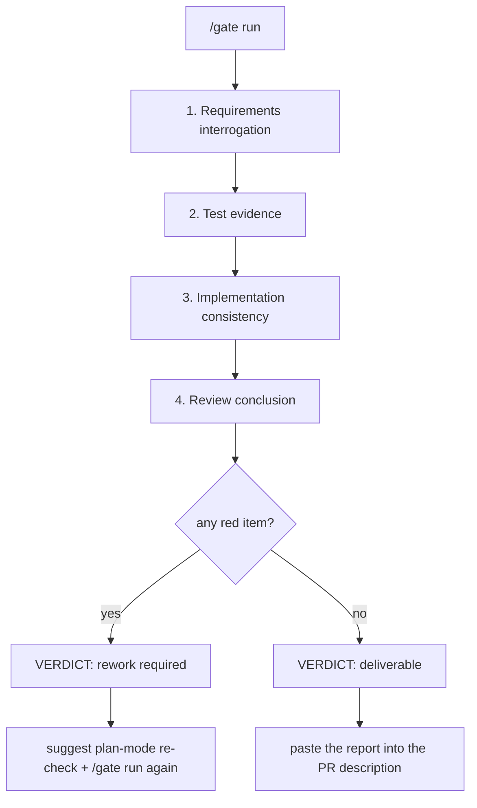

# dsh-doublecheck

> **La puerta de calidad de entrega para DeepSeek Harness: interroga los requisitos, prueba la implementación, demuestra la entrega — y luego controla el traspaso con una decisión de entregable / rehacer requerido.**

[](https://github.com/PerryLink/dsh-doublecheck/releases)
[](https://www.npmjs.com/package/dsh-doublecheck)
[](https://www.npmjs.com/package/dsh-doublecheck)
[](LICENSE)
[](https://github.com/topics/dsh-plugin)
[](https://github.com/PerryLink/dsh-doublecheck/actions/workflows/ci.yml)

Un **bundle de disciplina de ingeniería y panel de puerta de calidad de entrega** para [DeepSeek Harness](https://github.com/deepseek-ai/deepseek-harness). A los agentes les encanta empezar a programar; los requisitos odian que se los dé por sentados. `dsh-doublecheck` instala un bucle de disciplina que obliga al agente a **interrogar los requisitos antes de la primera edición y a demostrar la entrega en lugar de afirmarla** — y un **panel de puerta de entrega** que agrega la interrogación de requisitos, la evidencia de pruebas, la consistencia diff↔requisito y una conclusión de revisión en una única decisión de **entregable / rehacer requerido**, plasmada en un informe markdown listo para PR. Reimplementado de forma nativa sobre los puntos de extensión propios de DSH (registro de skills, pipeline de políticas de herramientas, seam de aprobación, seams de subagente y workflow, comandos, proyecciones de sesión, espacio de nombres de ajustes, modo plan), no sobre archivos de prompt prestados. Probado contra DSH `0.1.0-rc.6`.

La metodología está inspirada en [obra/superpowers](https://github.com/obra/superpowers) y [TimothyVang/Grill-me](https://github.com/TimothyVang/Grill-me). Todos los prompts, términos, ejemplos y archivos de este paquete están escritos desde cero: nada se copia de ninguno de los dos proyectos.

## Por qué

- Las tareas vagas producen software equivocado. Una petición breve («hazme una función») esconde seis decisiones sin resolver; hoy el agente las adivina todas y tú pagas por la suposición.
- Los equipos disciplinados hacen esto con humanos: revisión de requisitos → prueba que falla → prueba que pasa → autorrevisión → prueba de entrega. Los agentes merecen el mismo bucle, impuesto por el harness y no por la buena voluntad.
- Publicar necesita una decisión, no una corazonada. La puerta de entrega convierte la evidencia del bucle en un único veredicto de **entregable / rehacer requerido** con elementos rojos y sugerencias de rehacer — el panel que una plataforma de evaluación pega en la descripción de su PR.

## El bucle de disciplina

```
grill ──▶ design ──▶ red ──▶ green ──▶ review ──▶ verify
  │         │
  │      (v0.1)        (v0.2+)        (v0.3)         (v0.4)
  │
  └─ horno de requisitos: seis dimensiones, puerta de consenso,
     spec estructurado guardado en la sesión y en el workspace
```

| Etapa | Significado | Estado |
|---|---|---|
| **grill** | Interrogar las seis dimensiones de requisitos; negarse a implementar hasta el consenso. | ✅ v0.1 |
| **design** | Spec registrado con `doublecheck_spec`. | ✅ v0.1 |
| **red** | Una prueba que falla demuestra el hueco; las ediciones de implementación necesitan tenerla registrada. | ✅ v0.2 |
| **green** | Una prueba que pasa tras las ediciones cierra el bucle. | ✅ v0.2 |
| **review** | Un crítico adversario bifurcado audita la entrega contra el spec. | ✅ v0.3 |
| **verify** | `doublecheck_report` + un workflow de verificación por dimensión demuestran la entrega. | ✅ v0.4 |

## La puerta de entrega (v0.7)

La puerta es el **front end productizado del bucle**: agrega la evidencia durable de la sesión en una checklist configurable de cuatro fases y emite una única decisión binaria. Cada fase se pliega solo con el registro de sesión (el replay ES el estado), de modo que una ejecución de la puerta se vuelve a derivar de forma idéntica tras reanudar o bifurcar.



| Fase | Comprobaciones | Fuente de evidencia | Coste de modelo |
|---|---|---|---|
| **Interrogación de requisitos** | Checklist configurable de preguntas clave, confirmada elemento a elemento (seis preguntas de dimensión del spec por defecto). | `doublecheck_spec` registrado + llamadas `ask_user_question`. | ninguno |
| **Evidencia de pruebas** | Color de la última ejecución, ejecuciones fallidas después de green, umbral de cobertura opcional. | Ejecuciones de prueba de shell en el registro de sesión (`[exit code: N]`, porcentajes de cobertura). | ninguno |
| **Consistencia de implementación** | Mapeo diff ↔ requisito: cada edición debe servir a una dimensión del spec. | Revisor bifurcado local (hallazgos estructurados, herramientas de solo lectura). | un subagente |
| **Conclusión de revisión** | El veredicto de entrega. `engine: auto` consume los registros de veredicto durable de **dsh-auto-review** cuando están presentes y degrada al revisor local en caso contrario; `engine: local` usa siempre el revisor local. | Eventos `autoReview/verdict` / `autoReview/rejection`, o el revisor bifurcado local. | un subagente (local) |

- **Luces rojas** son comprobaciones fallidas: un spec ausente, una última ejecución de prueba que falla, cobertura por debajo del mínimo, una edición sin mapear, una llamada de motor rechazada, hallazgos de revisión blocker/major. Cada elemento rojo lleva una sugerencia de rehacer.
- **Las advertencias y omisiones nunca cambian la decisión**: una revisión omitida mantiene el informe honesto («no revisado») sin inventar una luz roja — falla cerrado para las afirmaciones, nunca para la evidencia.
- **Modo plan y aprobaciones**: un veredicto de rehacer sugiere reabrir el trabajo en modo plan (en el banner del informe, el panel `/gate status` y el aviso de turno de una vez por sesión). Las puertas de disciplina de abajo conservan su aplicación en la cadena de aprobación `warn`/`block`; la puerta en sí es consultiva.
- **Auditable por construcción**: los informes registran solo conteos, ids y veredictos — sin contenidos de archivos ni texto de sesión. Los textos de hallazgos producidos por el modelo pasan por un redactor de secretos (claves de nube, tokens, bloques de clave privada, asignaciones de contraseña, secuencias largas hex/base64) antes de almacenarse o mostrarse. El estado asentado viaja por el evento de sesión durable `doublecheck/gate` y por el `gate-report.md` del workspace.

### Informe de ejemplo

`/gate run` devuelve este markdown — pégalo en la descripción de un PR:

````markdown
# Delivery gate report

> **Verdict: rework required** — 2 red item(s)
> The gate is red. Re-open the work in plan mode to re-check the open items before delivering.

## 1. Requirements interrogation — PASS
- [✔] **What outcome must the delivery produce?** — spec dimension "goal" committed
- [✔] **What is in scope, and what is out of scope?** — spec dimension "scope" committed
- [✔] **Which observable checks prove the work is done?** — spec dimension "acceptanceCriteria" committed
- [✔] **What can go wrong, and what is the correct behavior in each case?** — spec dimension "failureModes" committed
- [✔] **What is traded when goals conflict; what is optional?** — spec dimension "priorities" committed
- [✔] **What does the user explicitly not want?** — spec dimension "nonGoals" committed

## 2. Test evidence — FAIL
- [✔] **passing test run** — latest test run passed
- [✔] **failing cases after green** — 0 failing run(s) after green (allowed: 0)
- [✖] **coverage evidence** — 61% coverage below the 80% minimum — rework: raise coverage above the configured minimum

## 3. Implementation consistency — WARN
- [⚠] **[minor] src/telemetry.ts touched without a requirement** — [minor] the edit adds a metric no spec dimension covers

## 4. Review conclusion — PASS
- [✔] **dsh-auto-review conclusion** — 3 call(s) approved by dsh-auto-review (latest risk: low)

## Red items
1. **tests/coverage** — 61% coverage below the 80% minimum — *rework: raise coverage above the configured minimum*
2. **consistency/finding-1** — [minor] the edit adds a metric no spec dimension covers — *rework: src/telemetry.ts touched without a requirement*

## Audit
- review engine: dsh-auto-review
- generated at: 2026-08-14T12:00:00.000Z
- counts, ids, and verdicts only: no file contents or session text are embedded, and recognized secrets are redacted.
````

### Dependencia débil de dsh-auto-review

La puerta se integra con [dsh-auto-review](https://github.com/PerryLink/dsh-auto-review) como **«usar el motor cuando esté ahí»**, nunca como dependencia dura:

- `review.engine: auto` (por defecto) pliega los registros de veredicto durable del motor (`autoReview/verdict` / `autoReview/rejection`) desde el registro de sesión — las conclusiones reales del motor sobre las revisiones de la cadena de aprobación de esta sesión. Las llamadas rechazadas o de alto riesgo se convierten en elementos rojos.
- Sin registros (el motor no está instalado, o nada lo disparó en esta sesión) → la fase degrada al revisor bifurcado local y nombra el motivo en una comprobación de advertencia: `dsh-auto-review is not installed` / `dsh-auto-review is installed but has no verdict records in this session`.
- La puerta **nunca sintetiza solicitudes de aprobación**: esa cadena puede llegar a un humano. Los propios registros del motor son la evidencia; `engine: local` la omite por completo.

### Superficie de ajustes

La checklist conectable es config validada por Schema (`gate.*` en la fila guard) y además se registra como el **espacio de nombres de ajustes `doublecheck.gate`** (`expose: true`, `applies: restart`) cuando el servicio de ajustes del harness está montado — así las UIs capaces de ajustes pueden leer y editar la checklist sin editar un profile a mano.

## Funciones

- 🔥 **Skill `grill-requirements`** — un skill empaquetado en formato Agent Skills que interroga la tarea en seis dimensiones (**objetivo, alcance, criterios de aceptación, modos de fallo, prioridades, no-objetivos**) con la UI nativa `ask_user_question` de DSH, se niega a escribir código hasta el consenso y registra el contrato.
- 🧰 **Skills de etapa para todo el bucle** — `red-green-tdd` (escribe la prueba que falla, ejecuta red, implementa, ejecuta green), `delivery-review` (autorrevisión adversaria contra el spec una vez en green) y `delivery-proof` (consolida la evidencia en el informe de entrega y pasa la puerta de entrega antes de declarar completado) se unen a `grill-requirements`: las seis etapas tienen guía de modelo, no solo la primera.
- 📜 **Herramienta `doublecheck_spec`** — guarda el spec acordado en el registro de sesión y escribe una copia en markdown en el workspace, para que el contrato sobreviva a la conversación. Las dimensiones vacías o solo con espacios se rechazan en el commit (v0.6): el grill debe asentar las seis antes de que el spec cuente.
- 🔄 **Re-grill ante cambio de tarea** — un spec registrado cubre su propia tarea: una nueva petición directa del usuario después del último spec reabre la puerta grill para ese seguimiento, en lugar de heredar el contrato anterior en silencio.
- 🛡️ **Guard de disciplina** — una puerta blanda en el pipeline de políticas de herramientas. Tarea vaga + sin spec + rumbo a `edit`/`write` → **recordar**, **pedir aprobación humana** o **bloquear**, según `intensity`.
- 🟥🟩 **Puertas de evidencia red/green** (`modules.tdd`) — comprobaciones duras sobre el registro de sesión: una edición de implementación requiere una **prueba que falla registrada** desde la última prueba que pasa (escribir archivos de prueba siempre está permitido — así ocurre el paso red), y un turno que termina con ediciones pero sin ninguna prueba que pasa recibe un recordatorio green inyectado. Las herramientas guard personalizadas funcionan de serie: las puertas leen las claves de argumento `file_path` y `path`, y una llamada que no nombra ningún archivo no se trata como edición de implementación.
- 👁️ **Revisión adversaria** (`modules.adversary`) — una vez que la entrega alcanza green, un subagente crítico bifurcado (seam nativo de subagentes de DSH, provider `fork` por defecto) audita la sesión contra el spec registrado con una postura adversaria y devuelve hallazgos estructurados, ordenados con los blockers primero. `remind` inyecta la crítica; `warn`/`block` además dirigen una ronda para que el modelo responda a los hallazgos. `adversaryModel` enruta al crítico hacia un modelo separado; la allowlist de herramientas del crítico es de solo lectura por defecto. Los hallazgos viajan por la fuente de mensajes durable `doublecheck-review`. La revisión se rearma cuando el crítico termina: las ediciones de implementación posteriores al último registro de revisión disparan otra ronda, y cancelar el turno aborta al crítico en vuelo.
- 🚦 **Puerta de calidad de entrega** (v0.7) — la checklist configurable de cuatro fases de arriba: interrogación de requisitos (preguntas clave confirmadas elemento a elemento), evidencia de pruebas (color de ejecución, casos fallidos, umbral de cobertura), consistencia de implementación (mapeo diff ↔ requisito por un revisor local) y la conclusión de revisión (registros de veredicto de dsh-auto-review con una degradación local honesta). Una única decisión de **entregable / rehacer requerido**, elementos rojos con sugerencias de rehacer, una sugerencia de re-comprobación en modo plan en rojo, un aviso rojo en el límite del turno (breve, una vez por sesión) y el informe markdown listo para PR.
- ⌨️ **Comando de sesión `/gate`** — `status` muestra el progreso en vivo de la checklist (las fases deterministas se pliegan al momento; las fases de revisor muestran la última ejecución), `run` asienta la puerta completa y devuelve el informe, `config` muestra la checklist y los umbrales efectivos.
- 🌐 **Superficie de modelo totalmente localizada** — cada cadena visible para el modelo que el paquete inyecta o responde (recordatorios, feedback de denegación/consulta, dirección de revisión, avisos de puerta, avisos de cambio, respuestas de `/doublecheck` y `/gate`, y los prompts de tarea del revisor) respeta `language: 'en' | 'zh'`; los documentos spec/report/gate del workspace conservan sus encabezados estables en inglés y sus ids de auditoría.
- 📊 **Informe doublecheck + workflow de verificación** (`doublecheck_report`, v0.4) — consolida la evidencia de disciplina de la sesión (spec, cronología red/green, hallazgos de revisión, ediciones) en un informe de entrega con un veredicto derivado (`grill → draft → red → green → objections/verified → proven/challenged/unverified`), escrito en el workspace. Con `verify`, los verificadores por dimensión corren a través del seam de workflow de DSH (`verifyMode: all` lanza un verificador paralelo por dimensión; `single` ejecuta uno combinado) y sus veredictos se pliegan en el informe — `proven` exige un veredicto para cada dimensión.
- 🚦 **Puerta de entrega** — en el límite del turno, una entrega que llegó a green sin `doublecheck_report` registrado recibe un recordatorio de informe esperado antes de declarar completado; un informe exitoso avanza la etapa a `verify`.
- 🔁 **Estado duradero** — todo artefacto visible para el modelo (spec, recordatorios, feedback de denegación, hallazgos de revisión, ejecuciones de puerta, el interruptor `/doublecheck on|off`) queda en el registro de sesión; las decisiones de la puerta se derivan solo del registro (`tool/call` + `tool/result`, incluidos los sub-despachos de Code Mode), así que las sesiones reanudadas o bifurcadas se comportan igual. `remindOnce` también es duradero: una sesión que ya recibió un recordatorio nunca lo recibe dos veces, incluso tras un reinicio. El plegado del interruptor viaja en un snapshot incremental, así que las sesiones largas se mantienen en O(eventos nuevos) por llamada de herramienta.
- ⌨️ **Comando de sesión `/doublecheck`** — `status` informa el interruptor efectivo, los módulos configurados, la intensidad de aplicación, los hechos de etapa plegados y el último veredicto de puerta; `report` pliega el informe de entrega al momento; `on|off` escribe el override durable `doublecheck/state` e inyecta un aviso de cambio.
- 📚 **Herramienta `doublecheck_skills`** — lista y carga los skills del paquete a través del seam oficial del registro de skills.
- 🔒 **Overlay estricto** — `strict.patch.yml` activa todas las puertas con intensidad `block` y habilita el requisito de cobertura (80%) en una sola capa de patch (se incluye con el paquete).
- 🧩 **Compañero invariante independiente** — la fila `dsh-doublecheck/invariant` es una exportación de subruta real: informa de las contradicciones de la ruta de escritura del paquete (forma spec/report/review/gate y consistencia de veredictos) a través del registro `invariants` del host sin cargar el guard.

## Demo

Una ejecución headless real con `intensity: block` y todas las puertas habilitadas, transcripción registrada desde el registro de sesión duradero:

```sh
dsh --profile demo headless "把这个项目里最慢的代码直接改快，别问我任何问题，直接改文件。"
```

1. **grill** bloquea la primera edición — no hay spec registrado:
   `Error: Blocked by the dsh-doublecheck requirements guard: the task statement is vague and no doublecheck_spec exists for this session.`
2. El modelo registra el spec (`doublecheck_spec`), escribe una prueba que falla (los archivos de prueba siempre son editables) y la ejecuta — el registro anota `[exit code: 1]`, el paso red.
3. Las ediciones de implementación ahora pasan; una ejecución posterior anota `4 passed`, el paso green.
4. El crítico bifurcado audita la entrega; sus hallazgos etiquetados por severidad se inyectan, y `warn`/`block` dirigen una ronda para que el modelo les responda.
5. `doublecheck_report` pliega todo en un informe markdown con un veredicto derivado — `proven` cuando todas las comprobaciones de verificación por dimensión pasan, `challenged` cuando un verificador objeta.
6. **`/gate run`** asienta la checklist de cuatro fases en la decisión de **entregable / rehacer requerido**; un veredicto rojo lista los elementos rojos con sugerencias de rehacer y sugiere una re-comprobación en modo plan.

## Instalación

```sh
dsh plugin --profile <name> add dsh-doublecheck
dsh --profile <name> --dump-config   # espera una capa "# == dsh-doublecheck"
```

Ambas filas de plugin se activan automáticamente con el profile. También sirve instalar desde tarball:

```sh
pnpm pack
dsh plugin --profile <name> add ./dsh-doublecheck-0.7.0.tgz
```

La instalación por git no necesita npm:

```sh
dsh plugin --profile <name> add "github:PerryLink/dsh-doublecheck#v0.7.0"
```

Para un modo estricto sin configuración (todas las puertas activas, intensidad `block`, cobertura de puerta requerida), aplica el overlay incluido encima del bundle patch:

```sh
dsh --profile <name> --patch ./node_modules/dsh-doublecheck/strict.patch.yml
```

## Desinstalación

```sh
dsh plugin --profile <name> remove dsh-doublecheck
```

Para mantener el paquete pero desactivar una fila: sobrescríbela por id con `disabled: true` en el `cordis.patch.yml` del profile (`doublecheck-grill` / `doublecheck-guard`).

## Compatibilidad

- Verificado contra los peers `0.1.0-rc.6` (`@deepseek-ai/cordis ^4.0.1`); última verificación 2026-08-14 (Windows + Node 22).
- Las escrituras de sesión durable (`/doublecheck on|off` → `doublecheck/state`, `/gate run` → `doublecheck/gate`) necesitan la superficie de escritura `ignorable` del host (harness posterior a rc.6): en los hosts rc.6 el options bag se ignora y el evento queda required-on-read, así que el interruptor se mantiene en memoria y el registro de puerta vive solo en el resultado del comando + el archivo del workspace, hasta actualizar el harness.
- El espacio de nombres de ajustes `doublecheck.gate` se registra solo cuando el servicio de ajustes del harness está montado; los profiles sin él simplemente no tienen superficie de ajustes.
- La línea `plan mode:` de `/gate status` lee el servicio opcional `ctx.planMode`; los profiles sin él muestran `unknown`.

## Permisos y datos

- **Lee**: solo en proceso el registro de sesión (`tool/call` / `tool/result` / `tool/code-dispatch`, fuentes `user/message` inyectadas y los registros de veredicto foráneos `autoReview/*`); el estado opcional del servicio de modo plan.
- **Escribe**: `doublecheck-spec.md`, `doublecheck-report.md` y `gate-report.md` en el workspace de la sesión (rutas configurables), vía el seam `ctx.fs`; los eventos de sesión durable `doublecheck/state` y `doublecheck/gate`.
- **Llamadas al modelo**: las fases de consistencia y revisión local de la puerta (un subagente cada una por `/gate run`), la revisión adversaria opcional (`modules.adversary`, off por defecto) y el workflow de verificación de `doublecheck_report` (on por defecto) lanzan subagentes; nada más llama al modelo o a la red.
- **Nunca toca**: credenciales, variables de entorno ni archivos fuera del workspace de la sesión. Los informes de puerta contienen solo conteos, ids y veredictos; los secretos reconocidos en los textos del revisor se redactan antes de almacenarse o mostrarse.

## Resolución de problemas

| Síntoma | Causa y solución |
|---|---|
| No aparece la capa `# == dsh-doublecheck` en `--dump-config` | Falta el bundle patch o una fila está `disabled` — revisa el orden de parches del profile y los ids de fila. |
| Los gates nunca reaccionan | Ejecuta `/doublecheck status`: el interruptor de sesión puede estar apagado, o todos los `modules.*` están en false. |
| "Adversary review did not run: the subagents seam is not mounted" | Esta composición de profile no provee subagentes — monta uno (las composiciones spine lo traen) o desactiva `modules.adversary`. |
| `doublecheck_report` muestra `verification: null` | Falta el seam `workflowEngine` o el run fue rechazado/abortado — el informe lo indica en lugar de adivinar. |
| El informe dice `unverified` | La verificación corrió pero no todas las dimensiones del spec devolvieron veredicto — reintenta con `verify: true`; `proven` exige las seis. |
| `/gate run` muestra `Review conclusion — WARN: dsh-auto-review is not installed` | Degradación esperada: la fila del motor no está en este profile. Instala `dsh-auto-review`, o pon `gate.review.engine: local` para omitir la detección. |
| `/gate run` muestra `Implementation consistency — SKIP` | Falta el seam `subagents` (o el run agotó el tiempo) — monta un provider de subagentes; la puerta nunca falsifica un veredicto. |
| `/gate status` muestra `plan mode: unknown` | El profile no tiene montado un servicio de modo plan; la sugerencia sigue apareciendo en el informe y en el aviso de turno. |
| El registro de puerta no está en el registro de sesión | Este host rc.6 no estampa el marcador `ignorable` — el registro vive solo en el resultado del comando y en `gate-report.md`. |

## Configuración

Sobrescribe cualquier fila **por id** en el `cordis.patch.yml` del profile. Un patch reemplaza toda la config de la fila — reescribe cada clave:

```yaml
- id: doublecheck-grill
  config:
    specFile: 'specs/doublecheck-spec.md'   # default: 'doublecheck-spec.md'
    reportFile: 'specs/doublecheck-report.md'   # default: 'doublecheck-report.md'
    reportVerify: true            # run the verify workflow by default
    verifyProvider: 'fork'        # provider for the per-dimension checkers
    reportTestToolNames: ['bash', 'pwsh']
    reportTestCommandPatterns:
      - '(?:^|[;&|]\s*)(?:(?:pnpm|npm|npx|yarn|bun)(?:\s+run)?\s+(?:test|vitest|jest|mocha)(?:\s|$))'
      - '(?:^|[;&|]\s*)(?:(?:pytest|go\s+test|cargo\s+test|make\s+test|ctest)(?:\s|$))'
      - '(?:^|[;&|]\s*)(?:node\s+--test(?:\s|$))'
      - '(?:^|[;&|]\s*)(?:deno\s+test|uv\s+run\s+pytest)(?:\s|$)'
    reportMutationTools: ['edit', 'write']
    reportTestFilePatterns:
      - '(^|[\\/])(tests?|__tests__|specs?)([\\/]|$)'
      - '\\.(test|spec)\\.[A-Za-z0-9]+$'

- id: doublecheck-guard
  config:
    intensity: warn
    modules:
      grill: true
      tdd: true         # red/green evidence gates (v0.2)
      adversary: true   # forked critic review (v0.3)
    adversaryModel: null            # or e.g. 'deepseek-v4-pro' for a separate critic model
    adversaryProvider: 'fork'       # subagent provider the critic runs on
    adversaryMaxFindings: 5         # findings cap injected into the session
    adversaryTools: ['read', 'glob', 'grep']   # critic tool allowlist (read-only)
    adversaryTimeoutMs: 120000      # hard budget for one critic run
    guardTools: ['edit', 'write']
    vagueTaskMaxChars: 200
    remindOnce: true
    testToolNames: ['bash', 'pwsh']
    testCommandPatterns:
      - '(?:^|[;&|]\s*)(?:(?:pnpm|npm|npx|yarn|bun)(?:\s+run)?\s+(?:test|vitest|jest|mocha)(?:\s|$))'
      - '(?:^|[;&|]\s*)(?:(?:pytest|go\s+test|cargo\s+test|make\s+test|ctest)(?:\s|$))'
      - '(?:^|[;&|]\s*)(?:node\s+--test(?:\s|$))'
      - '(?:^|[;&|]\s*)(?:deno\s+test|uv\s+run\s+pytest)(?:\s|$)'
    testFilePatterns:
      - '(^|[\\/])(tests?|__tests__|specs?)([\\/]|$)'
      - '\\.(test|spec)\\.[A-Za-z0-9]+$'
    gate:
      enabled: true
      planSuggestion: true
      reportFile: 'gate-report.md'
      requirements:
        enabled: true
        checklist:
          - { id: goal, question: 'What outcome must the delivery produce?', specDimension: goal, required: true }
          - { id: scope, question: 'What is in scope, and what is out of scope?', specDimension: scope, required: true }
          - { id: acceptance, question: 'Which observable checks prove the work is done?', specDimension: acceptanceCriteria, required: true }
          - { id: failureModes, question: 'What can go wrong, and what is the correct behavior in each case?', specDimension: failureModes, required: true }
          - { id: priorities, question: 'What is traded when goals conflict; what is optional?', specDimension: priorities, required: true }
          - { id: nonGoals, question: 'What does the user explicitly not want?', specDimension: nonGoals, required: true }
        minConfirmed: 6
        interrogateTool: 'ask_user_question'
      tests:
        enabled: true
        requirePassingRun: true
        allowFailingRuns: 0
        requireCoverage: false
        minCoveragePct: 80
        coveragePattern: 'coverage[^\d]{0,40}(\d+(?:\.\d+)?)\s*%'
      consistency:
        enabled: true
        provider: fork
        model: null
        tools: ['read', 'glob', 'grep']
        timeoutMs: 120000
        maxFindings: 5
      review:
        enabled: true
        engine: auto          # auto = dsh-auto-review verdict records, else local
        provider: fork
        model: null
        tools: ['read', 'glob', 'grep']
        timeoutMs: 120000
        maxFindings: 5
```

El `strict.patch.yml` incluido es exactamente esta fila guard con `intensity: block`, todos los módulos activos y el requisito de cobertura de puerta habilitado — aplícalo como capa de patch después del bundle patch para el modo estricto sin editar un profile a mano.

### `intensity`

| Valor | Comportamiento ante un `edit`/`write` sujeto a la puerta |
|---|---|
| `remind` (por defecto) | La llamada sigue; un recordatorio viaja en el contexto del resultado hacia la siguiente petición del modelo. |
| `warn` | La llamada queda retenida a la espera de aprobación humana única vía el seam de aprobación (deniega si no hay canal). |
| `block` | La llamada se deniega con feedback que dirige al modelo a corregir primero la disciplina. |

### Ajustes

| Clave | Por defecto | Significado |
|---|---|---|
| `modules.grill` | `true` | En `false` desactiva la puerta grill. El interruptor de los skills/herramientas grill es el flag `disabled` de su fila. |
| `modules.tdd` | `true` | En `true` activa las puertas de evidencia red/green (v0.2); activado por defecto desde v0.5. |
| `modules.adversary` | `false` | En `true` activa la revisión del crítico bifurcado en green (v0.3); usa el seam `ctx.subagents` — un seam ausente se resuelve como un aviso «no disponible». |
| `enableByDefault` | `true` | Interruptor maestro para sesiones sin un registro `/doublecheck on|off`. |
| `language` | `'en'` | Idioma de la prosa inyectada de recordatorio/denegación/revisión/puerta (`en` / `zh`). |
| `guardTools` | `['edit', 'write']` | Nombres de herramientas de mutación que vigila el guard. |
| `vagueTaskMaxChars` | `200` | Las tareas más largas nunca se consideran vagas. Las tareas breves que nombran un archivo, ruta, URL, una palabra clave con guion bajo o una palabra clave con guion son concretas. |
| `remindOnce` | `true` | Inyectar el recordatorio de cada puerta como máximo una vez por sesión — durable entre reinicios (plegado desde el registro). |
| `testToolNames` | `['bash', 'pwsh']` | Nombres de herramientas de shell que pueden ejecutar pruebas. |
| `testCommandPatterns` | *(pnpm/npm/yarn/bun test, pytest, go/cargo/make test, node --test, deno test, uv run pytest)* | Expresiones regulares con las que debe coincidir un comando para contar como ejecución de prueba. |
| `testFilePatterns` | *(directorios de prueba, `*.test.*` / `*.spec.*`)* | Expresiones regulares que identifican archivos de prueba — siempre editables, exentos de la puerta red. |
| `adversaryModel` | `null` | Ruta del modelo crítico; `null` = el modelo principal se autorrevisa. |
| `adversaryProvider` | `'fork'` | Nombre del provider de subagentes en el que corre el crítico. |
| `adversaryMaxFindings` | `5` | Tope de hallazgos (1–20) inyectados en la sesión. |
| `adversaryTools` | `['read', 'glob', 'grep']` | Allowlist de herramientas del crítico; mantenla de solo lectura. |
| `adversaryTimeoutMs` | `120000` | Presupuesto de tiempo duro para una ejecución del crítico. |

La mala configuración falla en voz alta: una regex inválida, una lista de nombres vacía o duplicada, o un tope de hallazgos fuera de rango lanza un error al cargar en lugar de no hacer nada en silencio. Un crítico que no puede ejecutarse (seam ausente, fallo del provider, timeout) se resuelve como un aviso honesto «no disponible» en la sesión.

### Controles del informe (fila grill)

| Clave | Por defecto | Significado |
|---|---|---|
| `reportFile` | `'doublecheck-report.md'` | Archivo del workspace que recibe el markdown del informe. |
| `reportVerify` | `true` | Valor por defecto para el flag `verify` de la herramienta. |
| `verifyProvider` | `'fork'` | Provider de subagentes en el que corren los verificadores por dimensión. |
| `verifyMode` | `'all'` | `all` = un verificador paralelo por dimensión; `single` = un verificador combinado (un subagente, más barato). |
| `reportTestToolNames` / `reportTestCommandPatterns` | *(same defaults as the guard row)* | Clasificación de ejecuciones de prueba con alcance de informe. |
| `reportMutationTools` / `reportTestFilePatterns` | *(same defaults as the guard row)* | Clasificación de ediciones de implementación con alcance de informe. |

Los controles de clasificación del informe son independientes de los del guard: la aplicación de la puerta y el plegado del informe se pueden ajustar por separado sin que uno cambie silenciosamente al otro. La verificación degrada honestamente: un seam `workflowEngine` ausente o una ejecución rechazada deja `verification: null` y el markdown lo dice.

### Controles de puerta (fila guard)

| Clave | Por defecto | Significado |
|---|---|---|
| `gate.enabled` | `true` | Interruptor maestro del panel de puerta y del aviso rojo en el límite del turno. |
| `gate.planSuggestion` | `true` | Añade la sugerencia de re-comprobación en modo plan a los informes y paneles rojos. |
| `gate.reportFile` | `'gate-report.md'` | Archivo del workspace que recibe el informe de puerta. |
| `gate.requirements.enabled` | `true` | En `false` omite la fase de requisitos. |
| `gate.requirements.checklist` | *(seis preguntas de dimensión del spec)* | La checklist conectable de preguntas clave: `{ id, question, specDimension, required }`. `specDimension: null` se muestra como una advertencia de confirmación manual; las preguntas opcionales fallidas son advertencias, no luces rojas. |
| `gate.requirements.minConfirmed` | `6` | Mínimo de preguntas obligatorias que deben pasar (1..cantidad obligatoria). |
| `gate.requirements.interrogateTool` | `'ask_user_question'` | Nombre de la herramienta cuyas llamadas cuentan como evidencia de interrogación. |
| `gate.tests.enabled` | `true` | En `false` omite la fase de evidencia de pruebas. |
| `gate.tests.requirePassingRun` | `true` | Una última ejecución de prueba que no pasa (o ausente) es una luz roja. |
| `gate.tests.allowFailingRuns` | `0` | Ejecuciones fallidas después del último green permitidas antes de la luz roja. |
| `gate.tests.requireCoverage` | `false` | En `true` exige evidencia de cobertura en la salida de las pruebas. |
| `gate.tests.minCoveragePct` | `80` | Porcentaje mínimo de cobertura (0–100). |
| `gate.tests.coveragePattern` | `coverage…(\d+…)%` | Regex con un grupo de captura que parsea el porcentaje de cobertura (compilada sin distinguir mayúsculas). |
| `gate.consistency.enabled` | `true` | En `false` omite la fase de mapeo diff ↔ requisito. |
| `gate.consistency.provider` / `.model` / `.tools` / `.timeoutMs` / `.maxFindings` | `fork` / `null` / `read,glob,grep` / `120000` / `5` | Controles del revisor de consistencia local (model `null` = modelo principal). |
| `gate.review.enabled` | `true` | En `false` omite la conclusión de revisión. |
| `gate.review.engine` | `'auto'` | `auto` = registros de veredicto de dsh-auto-review cuando están presentes, si no el revisor local; `local` = siempre el revisor local. |
| `gate.review.provider` / `.model` / `.tools` / `.timeoutMs` / `.maxFindings` | *(same as consistency)* | Controles del revisor de revisión local. |

La configuración de la puerta se valida fallando en voz alta al cargar (ids duplicados, dimensiones de spec desconocidas, umbrales fuera de rango, regexes inválidas, listas de herramientas vacías lanzan error), y la checklist se expone a través del espacio de nombres de ajustes `doublecheck.gate` cuando el servicio de ajustes está montado. La puerta nunca sintetiza solicitudes de aprobación; los revisores locales son de solo lectura por defecto.

## Cómo funciona (puntos de extensión)

| Contribución | Mecanismo DSH |
|---|---|
| Skills empaquetados | `ctx.skills.registerProvider()` — seam de capacidad de skills, `source: bundled` |
| Herramienta de catálogo/carga | `ctx.tools.register()` — `doublecheck_skills` |
| Spec + archivo en workspace | herramienta `doublecheck_spec` + escritura opcional vía `ctx.fs` |
| Puerta de requisitos | waterfall `tools/pre-execute` — `allow` / `ask` (seam de aprobación) / `deny` |
| Puerta red | waterfall `tools/pre-execute` — comprobación dura de la evidencia de prueba fallida antes de las ediciones de implementación |
| Inyección de recordatorio | waterfall `tools/post-execute` — `additionalContexts` → registrado como `user/message` |
| Puerta green | `agent/turn-stopping` serial — inyecta un recordatorio de finalización cuando las ediciones carecen de una prueba que pasa |
| Revisión adversaria | `ctx.subagents.start()` — forked critic with structured findings schema, injected at green; `warn`/`block` steer one round |
| Informe de entrega | `doublecheck_report` tool — session-log fold + workspace markdown |
| Workflow de verificación | `ctx.workflowEngine.start()` — one parallel checker per spec dimension, structured checks |
| Fases deterministas de la puerta | pliegues puros del registro de sesión — checklist de preguntas clave contra el spec registrado; evidencia de ejecución de pruebas/cobertura |
| Fases de revisor de la puerta | `ctx.subagents.start()` — mapeador de consistencia + revisor local, hallazgos estructurados, herramientas de solo lectura |
| Revisión de motor | pliegues durables `autoReview/verdict` / `autoReview/rejection` + sondeo de presencia `ctx.commands.list()` (dependencia débil, sin import) |
| Sugerencia de modo plan | prosa de informe/panel + aviso de turno de una vez por sesión; lectura de `ctx.planMode` para la línea de estado (opcional) |
| Comando `/gate` | `ctx.commands.register()` — `status|run|config`; `run` escribe el evento durable `doublecheck/gate` + `gate-report.md` |
| Superficie de ajustes | `ctx.settings.register('doublecheck.gate', schema, { expose: true, applies: 'restart' })` cuando está montado |
| Estado duradero | session log fold over `tool/call` + `tool/result` + `tool/code-dispatch` + injected structured sources + `doublecheck/state` + `doublecheck/gate`; model-visible ⟺ logged |
| Comando de sesión | `ctx.commands.register()` — `/doublecheck status|report|on|off`; `on|off` escribe el evento de sesión durable `doublecheck/state` |
| Proyección de sesión | registro `sessionProjections` — la vista `doublecheck` ahora lleva `gateVerdict` + `gateRedCount` (stateVersion 2) |
| Eventos internos | `doublecheck/spec`, `doublecheck/reminder`, `doublecheck/review`, `doublecheck/report`, `doublecheck/gate` (typed via declaration merging, `@mode emit`) |

Sin cambios en el agent-loop. Cada registro es un `ctx.effect` / `ctx.on` / `register()` de servicio reversible.

## Qué ve el modelo

- El skill `grill-requirements` se une al catálogo de skills de la sesión y se carga con la herramienta integrada `skill` (o `doublecheck_skills`).
- `ask_user_question` sigue siendo la forma nativa de DSH de preguntar al usuario; el skill solo la coreografía (y en headless sin provider degrada a preguntas en prosa).
- Los recordatorios llegan como contexto `{kind:'plugin'}`, así que las UIs de transcripción los muestran como metadatos de inyección.
- La crítica del adversario llega de la misma manera cuando el crítico se asienta, con hallazgos etiquetados por severidad; bajo `warn`/`block` el bucle se dirige una ronda para que el modelo les responda.
- `doublecheck_report` devuelve el informe consolidado como resultado de herramienta (spec, cronología de pruebas, revisión, verificación, veredicto), así que «demostrar la entrega» está a una llamada de distancia.
- El aviso rojo de puerta en el turno llega como contexto `{kind:'doublecheck-gate'}` — una frase breve de declaración de rol más el conteo de rojos y la sugerencia de modo plan.
- `/doublecheck` y `/gate` responden directamente en la transcripción: `status` muestra el interruptor, los módulos, la intensidad, los hechos de etapa y el último veredicto de puerta; `report` imprime el informe plegado; `on|off` cambia el interruptor de sesión; `/gate run` devuelve el informe de puerta listo para PR.

## Comandos de sesión

```
/doublecheck status|report|on|off
/gate status|run|config
```

- `/doublecheck status` — interruptor efectivo (el override durable vence al valor por defecto de la config), módulos configurados, intensidad de aplicación, los hechos de etapa plegados (spec registrado, color red/green, revisión en registro, número de ediciones) y el último veredicto de puerta.
- `/doublecheck report` — pliega el informe de entrega desde el registro de sesión al momento (sin workflow de verificación; `doublecheck_report` es dueño de esa ruta).
- `/doublecheck on|off` — escribe el evento durable `doublecheck/state` (sobrevive a reinicio, reanudación y bifurcación — el replay ES el estado) e inyecta un aviso de cambio visible para el modelo.
- `/gate status` — el progreso en vivo de la checklist: las fases deterministas se pliegan al momento, las fases de revisor y el veredicto muestran la última ejecución `doublecheck/gate`, más el estado de modo plan.
- `/gate run` — asienta la checklist completa de cuatro fases (pliegues deterministas + dos forks de revisor local en paralelo; los registros de veredicto del motor cuando están presentes), escribe el evento durable `doublecheck/gate` y `gate-report.md`, y devuelve el markdown del informe.
- `/gate config` — muestra la checklist efectiva, los umbrales y los controles del revisor.

Todas las respuestas del comando respetan el ajuste `language` de la fila guard; los documentos de informe conservan sus encabezados estables en inglés y sus ids de auditoría.

## Hoja de ruta

El bucle de disciplina y la puerta de entrega se incluyen ambos: **grill → design → red → green → review → verify** (v0.1 → v0.6) más la **puerta de calidad de cuatro fases con la decisión de entregable/rehacer** (v0.7). Los fixtures de regresión con transcripciones reales fijan las formas de los eventos durables (`tests/fixtures/`). Trabajo futuro: una pestaña de ajustes en la Web UI y una insignia de puerta para la proyección `doublecheck`, un formato de informe más rico y la siembra de spec entre sesiones desde el archivo del workspace.

## Desarrollo

```sh
pnpm install --ignore-workspace
pnpm run typecheck
pnpm run lint
pnpm run test
pnpm run build
```

## Agradecimientos

Metodología inspirada en [obra/superpowers](https://github.com/obra/superpowers) (disciplina de ingeniería estilo TDD) y [TimothyVang/Grill-me](https://github.com/TimothyVang/Grill-me) (interrogar los requisitos antes de implementar). Este paquete es una implementación original: no se copia ningún texto, prompt o archivo de ninguno de los dos proyectos.

## Colaboradores

- [PerryLink](https://github.com/PerryLink) — autor y mantenedor: el bucle de disciplina v0.1 → v0.7 y la puerta de entrega, la documentación en cinco idiomas, el pipeline de CI/publicación y los envíos al ecosistema ([awesome-dsh-plugin#451](https://github.com/awesome-dsh-plugin/awesome-dsh-plugin/pull/451), [awesome-dsh-plugins#147](https://github.com/AdamPlatin123/awesome-dsh-plugins/pull/147), [awesome-deepseek-harness#179](https://github.com/0xsline/awesome-deepseek-harness/pull/179), [bruc3van/awesome-dsh-plugin#36](https://github.com/bruc3van/awesome-dsh-plugin/pull/36), [dsh-hub-workshop#13](https://github.com/omdsh-dev/dsh-hub-workshop/issues/13)/[#19](https://github.com/omdsh-dev/dsh-hub-workshop/pull/19)).

Issues, pull requests y Discussions son bienvenidos — los puntos de entrada están al inicio de este documento.

## Familia de plugins DSH de PerryLink

Este proyecto es uno de los [15 plugins de DeepSeek Harness](https://github.com/PerryLink) mantenidos por [PerryLink](https://github.com/PerryLink). Si este te ayuda, probablemente los demás también:

| Plugin | Una línea |
|---|---|
| [dsh-mcp-panel](https://github.com/PerryLink/dsh-mcp-panel) | Panel de runtime MCP de solo lectura: comando /mcp + pestaña de Ajustes con estado, herramientas y errores |
| **[dsh-doublecheck](https://github.com/PerryLink/dsh-doublecheck)** | Guard de disciplina de ingeniería + puerta de calidad de entrega: grill de requisitos, puertas de pruebas, revisión adversaria, panel entregable/rehacer de /gate |
| [dsh-background-agents](https://github.com/PerryLink/dsh-background-agents) | Agentes hijos en segundo plano durables con sidebar en la Web UI, mensajería e interrupción |
| [dsh-lsp-actions](https://github.com/PerryLink/dsh-lsp-actions) | Diagnósticos, formateo, completado, acciones de código y rename de LSP sobre servidores de lenguaje |
| [dsh-output-styles](https://github.com/PerryLink/dsh-output-styles) | Cambio de estilo de salida en runtime equivalente a outputStyles de Claude Code |
| [dsh-checkpoint-rewind](https://github.com/PerryLink/dsh-checkpoint-rewind) | Equivalente a /rewind de Claude Code: snapshots, forks de sesión, restauración de un disparo |
| [dsh-permission-rules](https://github.com/PerryLink/dsh-permission-rules) | Reglas de permisos declarativas allow/deny/ask estilo Claude Code con auditoría |
| [dsh-auto-review](https://github.com/PerryLink/dsh-auto-review) | Auto-revisión de segundo modelo en la cadena de aprobación, fail-closed por defecto |
| [dsh-memento](https://github.com/PerryLink/dsh-memento) | Memoria entre sesiones con aprobación: seam ctx.memory + SQLite + herramienta de memoria |
| [dsh-skill-pack-security](https://github.com/PerryLink/dsh-skill-pack-security) | Pack de skills de auditoría de seguridad: escaneo de secretos, revisión de dependencias y cadena de suministro |
| [dsh-session-pin](https://github.com/PerryLink/dsh-session-pin) | Fija sesiones en el sidebar web con orden durable |
| [dsh-composer-history](https://github.com/PerryLink/dsh-composer-history) | Historial de entrada estilo terminal para el compositor web: flechas, búsqueda Ctrl+R |
| [dsh-github](https://github.com/PerryLink/dsh-github) | Integración de PR/issues de GitHub para DSH, cada escritura sujeta a aprobación |
| [dsh-plugin-guide](https://github.com/PerryLink/dsh-plugin-guide) | Base de conocimiento de desarrollo de plugins como skill de agente bajo demanda |
| [dsh-claude-move](https://github.com/PerryLink/dsh-claude-move) | Migra sesiones, memoria, skills y CLAUDE.md de Claude Code a DSH |

## Licencia

[Apache-2.0](LICENSE)
