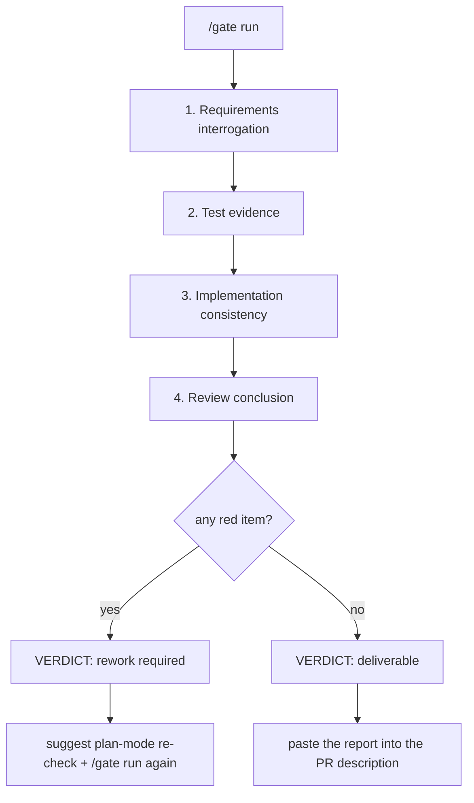

# dsh-doublecheck

> **DeepSeek Harness के लिए डिलीवरी गुणवत्ता-द्वार: आवश्यकताओं की पड़ताल करें, कार्यान्वयन का परीक्षण करें, डिलीवरी साबित करें — फिर deliverable / rework required निर्णय से हैंडऑफ़ को नियंत्रित करें।**

[](https://github.com/PerryLink/dsh-doublecheck/releases)
[](https://www.npmjs.com/package/dsh-doublecheck)
[](https://www.npmjs.com/package/dsh-doublecheck)
[](LICENSE)
[](https://github.com/topics/dsh-plugin)
[](https://github.com/PerryLink/dsh-doublecheck/actions/workflows/ci.yml)

[DeepSeek Harness](https://github.com/deepseek-ai/deepseek-harness) के लिए एक **इंजीनियरिंग-अनुशासन बंडल और डिलीवरी गुणवत्ता-द्वार पैनल**। एजेंट तुरंत कोड लिखना चाहते हैं; आवश्यकताएँ मान लिए जाना पसंद नहीं करतीं। `dsh-doublecheck` एक अनुशासन-चक्र स्थापित करता है जो एजेंट को **पहले संपादन से पहले आवश्यकताओं की पड़ताल करने** और **डिलीवरी का दावा करने के बजाय उसे साबित करने** के लिए बाध्य करता है — और एक **डिलीवरी द्वार पैनल** जो आवश्यकता-पड़ताल, परीक्षण-प्रमाण, diff↔आवश्यकता संगति और एक समीक्षा-निष्कर्ष को एक **deliverable / rework required** निर्णय में समेकित करता है, जो PR-तैयार markdown रिपोर्ट के रूप में प्रस्तुत होता है। पूरी तरह DSH के अपने एक्सटेंशन पॉइंट्स (स्किल रजिस्ट्री, टूल पॉलिसी पाइपलाइन, अप्रूवल सीम, उप-एजेंट और वर्कफ़्लो सीम, कमांड, सेशन प्रोजेक्शन, सेटिंग्स नेमस्पेस, प्लान मोड) पर मूल रूप से पुनः लागू, किसी उधार की प्रॉम्प्ट फ़ाइल पर नहीं। DSH `0.1.0-rc.6` के विरुद्ध परीक्षण किया गया।

कार्यप्रणाली [obra/superpowers](https://github.com/obra/superpowers) और [TimothyVang/Grill-me](https://github.com/TimothyVang/Grill-me) से प्रेरित है। इस पैकेज का हर प्रॉम्प्ट, शब्द, उदाहरण और फ़ाइल शुरू से लिखा गया है — दोनों में से किसी भी परियोजना से कुछ भी कॉपी नहीं किया गया।

## क्यों

- अस्पष्ट कार्य गलत सॉफ़्टवेयर बनाते हैं। एक छोटा सा अनुरोध («मेरे लिए एक फ़ीचर बनाओ») छह अनसुलझे निर्णय छिपाता है; आज एजेंट सभी का अनुमान लगाता है और आप उस अनुमान की कीमत चुकाते हैं।
- अनुशासित टीमें यही इंसानों के साथ करती हैं: आवश्यकता-समीक्षा → असफल परीक्षण → सफल परीक्षण → आत्म-समीक्षा → डिलीवरी-प्रमाण। एजेंट भी उसी चक्र के हक़दार हैं — हार्नेस द्वारा लागू, भरोसे से नहीं।
- शिपिंग के लिए निर्णय चाहिए, अंदाज़ा नहीं। डिलीवरी द्वार चक्र के प्रमाण को लाल आइटमों और पुनर्कार्य सुझावों के साथ एक **deliverable / rework required** फ़ैसले में बदल देता है — वह पैनल जिसे मूल्यांकन प्लेटफ़ॉर्म अपने PR विवरण में चिपकाता है।

## अनुशासन-चक्र

```
grill ──▶ design ──▶ red ──▶ green ──▶ review ──▶ verify
  │         │
  │      (v0.1)        (v0.2+)        (v0.3)         (v0.4)
  │
  └─ आवश्यकता-भट्टी: छह आयाम, सहमति-द्वार,
     संरचित spec सेशन और वर्कस्पेस में दर्ज
```

| चरण | अर्थ | स्थिति |
|---|---|---|
| **grill** | छह आवश्यकता-आयामों की पड़ताल; सहमति तक कार्यान्वयन से इनकार। | ✅ v0.1 |
| **design** | `doublecheck_spec` से spec दर्ज। | ✅ v0.1 |
| **red** | असफल परीक्षण अंतर साबित करता है; कार्यान्वयन संपादनों को यह लॉग में दर्ज चाहिए। | ✅ v0.2 |
| **green** | संपादनों के बाद पास होने वाला परीक्षण चक्र पूरा करता है। | ✅ v0.2 |
| **review** | एक फ़ॉर्क किया गया विरोधी-आलोचक spec के विरुद्ध डिलीवरी का ऑडिट करता है। | ✅ v0.3 |
| **verify** | `doublecheck_report` + प्रति-आयाम सत्यापन वर्कफ़्लो डिलीवरी साबित करते हैं। | ✅ v0.4 |

## डिलीवरी द्वार (v0.7)

द्वार चक्र का **उत्पाद-रूपी फ्रंट एंड** है: यह सेशन के टिकाऊ प्रमाण को एक कॉन्फ़िगर करने योग्य चार-चरण चेकलिस्ट में समेकित करता है और एक बाइनरी निर्णय देता है। हर चरण केवल सेशन लॉग को fold करता है (replay ही state है), इसलिए resume या fork के बाद द्वार रन समान रूप से फिर से निकाला जाता है।



| चरण | जाँचें | प्रमाण-स्रोत | मॉडल लागत |
|---|---|---|---|
| **आवश्यकता-पड़ताल** | कॉन्फ़िगर करने योग्य प्रमुख-प्रश्न चेकलिस्ट, आइटम-दर-आइटम पुष्ट (डिफ़ॉल्ट रूप से छह spec-आयाम प्रश्न)। | दर्ज `doublecheck_spec` + `ask_user_question` कॉल। | कोई नहीं |
| **परीक्षण-प्रमाण** | नवीनतम रन का रंग, green के बाद असफल रन, वैकल्पिक कवरेज-सीमा। | सेशन लॉग में शेल परीक्षण रन (`[exit code: N]`, कवरेज प्रतिशत)। | कोई नहीं |
| **कार्यान्वयन संगति** | diff ↔ आवश्यकता मैपिंग: हर संपादन को एक spec-आयाम की पूर्ति करनी चाहिए। | स्थानीय फ़ॉर्क किया गया समीक्षक (संरचित निष्कर्ष, read-only टूल)। | एक उप-एजेंट |
| **समीक्षा-निष्कर्ष** | डिलीवरी फ़ैसला। `engine: auto` **dsh-auto-review** के टिकाऊ फ़ैसले-रिकॉर्ड तब उपभोग करता है जब वे मौजूद हों और अन्यथा स्थानीय समीक्षक पर उतर आता है; `engine: local` हमेशा स्थानीय समीक्षक का उपयोग करता है। | `autoReview/verdict` / `autoReview/rejection` इवेंट, या स्थानीय फ़ॉर्क समीक्षक। | एक उप-एजेंट (local) |

- **लाल बत्तियाँ** असफल जाँचें हैं: spec ग़ायब, नवीनतम परीक्षण रन असफल, न्यूनतम से कम कवरेज, बिना-मैप संपादन, अस्वीकृत engine कॉल, blocker/major समीक्षा-निष्कर्ष। हर लाल आइटम में पुनर्कार्य सुझाव होता है।
- **चेतावनियाँ और skips निर्णय कभी नहीं बदलते**: छोड़ी गई समीक्षा रिपोर्ट को ईमानदार रखती है ("not reviewed") बिना लाल बत्ती गढ़े — दावों के लिए fail-closed, प्रमाण के लिए कभी नहीं।
- **प्लान मोड और अनुमोदन**: पुनर्कार्य फ़ैसला काम को प्लान मोड में फिर खोलने का सुझाव देता है (रिपोर्ट बैनर, `/gate status` पैनल और प्रति-सेशन एक बार टर्न सूचना में)। नीचे के अनुशासन-द्वार अपना `warn`/`block` अप्रूवल-चेन प्रवर्तन बनाए रखते हैं; द्वार स्वयं परामर्शी है।
- **निर्माण से ही ऑडिट-सुरक्षित**: रिपोर्ट केवल गणनाएँ, ids और फ़ैसले दर्ज करती हैं — कोई फ़ाइल सामग्री या सेशन पाठ नहीं। मॉडल-निर्मित निष्कर्ष-पाठ संग्रहीत या दिखाए जाने से पहले एक गुप्त redactor (क्लाउड कुंजियाँ, टोकन, निजी-कुंजी ब्लॉक, पासवर्ड असाइनमेंट, लंबी hex/base64 शृंखलाएँ) से गुज़रते हैं। निपटा हुआ राज्य टिकाऊ `doublecheck/gate` सेशन इवेंट और वर्कस्पेस `gate-report.md` पर सवार होता है।

### उदाहरण रिपोर्ट

`/gate run` यह markdown लौटाता है — इसे PR विवरण में चिपकाएँ:

````markdown
# Delivery gate report

> **Verdict: rework required** — 2 red item(s)
> The gate is red. Re-open the work in plan mode to re-check the open items before delivering.

## 1. Requirements interrogation — PASS
- [✔] **What outcome must the delivery produce?** — spec dimension "goal" committed
- [✔] **What is in scope, and what is out of scope?** — spec dimension "scope" committed
- [✔] **Which observable checks prove the work is done?** — spec dimension "acceptanceCriteria" committed
- [✔] **What can go wrong, and what is the correct behavior in each case?** — spec dimension "failureModes" committed
- [✔] **What is traded when goals conflict; what is optional?** — spec dimension "priorities" committed
- [✔] **What does the user explicitly not want?** — spec dimension "nonGoals" committed

## 2. Test evidence — FAIL
- [✔] **passing test run** — latest test run passed
- [✔] **failing cases after green** — 0 failing run(s) after green (allowed: 0)
- [✖] **coverage evidence** — 61% coverage below the 80% minimum — rework: raise coverage above the configured minimum

## 3. Implementation consistency — WARN
- [⚠] **[minor] src/telemetry.ts touched without a requirement** — [minor] the edit adds a metric no spec dimension covers

## 4. Review conclusion — PASS
- [✔] **dsh-auto-review conclusion** — 3 call(s) approved by dsh-auto-review (latest risk: low)

## Red items
1. **tests/coverage** — 61% coverage below the 80% minimum — *rework: raise coverage above the configured minimum*
2. **consistency/finding-1** — [minor] the edit adds a metric no spec dimension covers — *rework: src/telemetry.ts touched without a requirement*

## Audit
- review engine: dsh-auto-review
- generated at: 2026-08-14T12:00:00.000Z
- counts, ids, and verdicts only: no file contents or session text are embedded, and recognized secrets are redacted.
````

### dsh-auto-review पर कमज़ोर निर्भरता

द्वार [dsh-auto-review](https://github.com/PerryLink/dsh-auto-review) के साथ **"engine होने पर उसका उपयोग करें"** के रूप में जुड़ता है, कभी कठोर निर्भरता के रूप में नहीं:

- `review.engine: auto` (डिफ़ॉल्ट) सेशन लॉग से engine के टिकाऊ फ़ैसले-रिकॉर्ड (`autoReview/verdict` / `autoReview/rejection`) fold करता है — इस सेशन की अप्रूवल-चेन समीक्षाओं पर engine के वास्तविक निष्कर्ष। अस्वीकृत या उच्च-जोखिम कॉल लाल आइटम बन जाते हैं।
- कोई रिकॉर्ड नहीं (engine स्थापित नहीं, या इस सेशन में कुछ भी उसे ट्रिगर नहीं किया) → चरण स्थानीय फ़ॉर्क समीक्षक पर उतर आता है और कारण को चेतावनी-जाँच पर नामित करता है: `dsh-auto-review is not installed` / `dsh-auto-review is installed but has no verdict records in this session`।
- द्वार **कभी अनुमोदन अनुरोध नहीं गढ़ता**: वह शृंखला मानव तक पहुँच सकती है। engine के अपने रिकॉर्ड ही प्रमाण हैं; `engine: local` इसे पूरी तरह छोड़ देता है।

### सेटिंग्स सतह

प्लग करने योग्य चेकलिस्ट Schema-मान्य config है (`gate.*` guard पंक्ति में) और अतिरिक्त रूप से **`doublecheck.gate` सेटिंग्स नेमस्पेस** (`expose: true`, `applies: restart`) के रूप में पंजीकृत होती है जब harness सेटिंग्स सेवा माउंट हो — ताकि सेटिंग्स-सक्षम UI बिना profile हाथ से संपादित किए चेकलिस्ट पढ़ और संपादित कर सकें।

## विशेषताएँ

- 🔥 **`grill-requirements` स्किल** — Agent Skills प्रारूप में पैक की गई स्किल, जो DSH की मूल `ask_user_question` UI से कार्य की छह आयामों (**लक्ष्य, दायरा, स्वीकृति-मानदंड, विफलता-स्थितियाँ, प्राथमिकताएँ, निषेध**) पर पड़ताल करती है, सहमति तक कोड लिखने से इनकार करती है और अनुबंध दर्ज करती है।
- 🧰 **पूरे चक्र के लिए चरण-स्किल्स** — `red-green-tdd` (असफल परीक्षण लिखें, red चलाएँ, लागू करें, green चलाएँ), `delivery-review` (green के बाद spec के विरुद्ध प्रतिकूल आत्म-समीक्षा) और `delivery-proof` (प्रमाण को डिलीवरी रिपोर्ट में समेकित करें और पूर्णता घोषित करने से पहले डिलीवरी द्वार पार करें) `grill-requirements` से जुड़ गए: छहों चरणों में मॉडल-मार्गदर्शन है, सिर्फ़ पहले में नहीं।
- 📜 **`doublecheck_spec` टूल** — सहमत spec को सेशन लॉग में दर्ज करता है और वर्कस्पेस में markdown प्रति लिखता है, ताकि अनुबंध बातचीत के बाद भी बचा रहे। खाली या केवल-व्हाइटस्पेस आयाम कमिट पर अस्वीकार होते हैं (v0.6): spec गिनने से पहले grill को छहों आयाम निपटाने होंगे।
- 🔄 **कार्य-बदलाव पर फिर grill** — दर्ज spec अपने ही कार्य को कवर करता है: नवीनतम spec के बाद उपयोगकर्ता का नया सीधा अनुरोध उस फ़ॉलो-अप के लिए grill द्वार फिर खोल देता है, पुराने अनुबंध को चुपचाप विरासत में लेने के बजाय।
- 🛡️ **अनुशासन गार्ड** — टूल पॉलिसी पाइपलाइन पर एक नरम द्वार। अस्पष्ट कार्य + spec नहीं + `edit`/`write` की ओर बढ़ना → `intensity` के अनुसार **याद दिलाना**, **मानव अनुमोदन माँगना** या **रोकना**।
- 🟥🟩 **Red/green प्रमाण-द्वार** (`modules.tdd`) — सेशन लॉग पर कड़ी जाँचें: कार्यान्वयन संपादन के लिए पिछले पास होने वाले परीक्षण के बाद से एक **असफल परीक्षण लॉग में दर्ज** होना चाहिए (परीक्षण फ़ाइलें लिखना हमेशा अनुमत है — red चरण ऐसे ही घटता है), और जो टर्न संपादनों के साथ पर बिना किसी पास होने वाले परीक्षण के समाप्त होता है, उसमें green अनुस्मारक इंजेक्ट होता है। कस्टम guard टूल बॉक्स से बाहर काम करते हैं: द्वार `file_path` और `path` दोनों argument-कुंजियाँ पढ़ते हैं, और जो कॉल कोई फ़ाइल नहीं बताती वह कार्यान्वयन संपादन नहीं मानी जाती।
- 👁️ **विरोधी-समीक्षा** (`modules.adversary`) — जब डिलीवरी green पर पहुँच जाती है, तब एक फ़ॉर्क किया गया आलोचक उप-एजेंट (DSH का मूल उप-एजेंट सीम, डिफ़ॉल्ट `fork` provider) प्रतिकूल रुख़ के साथ दर्ज spec के विरुद्ध सेशन का ऑडिट करता है और blocker-प्रथम क्रम में संरचित निष्कर्ष लौटाता है। `remind` आलोचना इंजेक्ट करता है; `warn`/`block` इसके अलावा एक राउंड चलाकर मॉडल से निष्कर्षों का उत्तर दिलवाते हैं। `adversaryModel` आलोचक को अलग मॉडल पर भेजता है; आलोचक की टूल allowlist डिफ़ॉल्ट रूप से read-only है। निष्कर्ष टिकाऊ `doublecheck-review` संदेश-स्रोत पर सवार होते हैं। आलोचक के निपटने के बाद समीक्षा फिर सक्रिय हो जाती है: नवीनतम समीक्षा-रिकॉर्ड के बाद कार्यान्वयन संपादन अगला राउंड चलाते हैं, और टर्न रद्द करने पर चालू आलोचक बाधित होता है।
- 🚦 **डिलीवरी गुणवत्ता-द्वार** (v0.7) — ऊपर की कॉन्फ़िगर करने योग्य चार-चरण चेकलिस्ट: आवश्यकता-पड़ताल (प्रमुख प्रश्न आइटम-दर-आइटम पुष्ट), परीक्षण-प्रमाण (रन का रंग, असफल मामले, कवरेज-सीमा), कार्यान्वयन संगति (स्थानीय समीक्षक द्वारा diff ↔ आवश्यकता मैपिंग) और समीक्षा-निष्कर्ष (ईमानदार स्थानीय गिरावट के साथ dsh-auto-review फ़ैसले-रिकॉर्ड)। एक **deliverable / rework required** निर्णय, पुनर्कार्य सुझावों वाले लाल आइटम, लाल पर प्लान-मोड पुनः-जाँच सुझाव, टर्न-सीमा लाल सूचना (छोटी, प्रति सेशन एक बार) और PR-तैयार markdown रिपोर्ट।
- ⌨️ **`/gate` सेशन कमांड** — `status` लाइव चेकलिस्ट प्रगति दिखाता है (नियतात्मक चरण वहीं fold होते हैं; समीक्षक चरण नवीनतम रन दिखाते हैं), `run` पूरा द्वार निपटाता है और रिपोर्ट लौटाता है, `config` प्रभावी चेकलिस्ट और सीमाएँ दिखाता है।
- 🌐 **पूरी तरह स्थानीयकृत मॉडल सतह** — पैकेज द्वारा इंजेक्ट या उत्तर दिए गए हर मॉडल-दृश्य वाक्य (अनुस्मारक, अस्वीकृति/पूछताछ फ़ीडबैक, समीक्षा-steering, द्वार सूचनाएँ, स्विच सूचनाएँ, `/doublecheck` और `/gate` उत्तर, समीक्षक के कार्य-प्रॉम्प्ट) `language: 'en' | 'zh'` का सम्मान करते हैं; वर्कस्पेस spec/report/gate दस्तावेज़ अपने स्थिर अंग्रेज़ी शीर्षक और ऑडिट ids रखते हैं।
- 📊 **Doublecheck रिपोर्ट + सत्यापन वर्कफ़्लो** (`doublecheck_report`, v0.4) — सेशन के अनुशासन-प्रमाण (spec, red/green समयरेखा, समीक्षा-निष्कर्ष, संपादन) को एक डिलीवरी रिपोर्ट में समेकित करता है, जिसमें व्युत्पन्न निर्णय होता है (`grill → draft → red → green → objections/verified → proven/challenged/unverified`), वर्कस्पेस में लिखी जाती है। `verify` के साथ, प्रति-आयाम जाँचकर्ता DSH के वर्कफ़्लो सीम से चलते हैं (`verifyMode: all` हर आयाम के लिए एक समानांतर जाँचकर्ता लॉन्च करता है; `single` एक संयुक्त जाँचकर्ता चलाता है) और उनके निर्णय रिपोर्ट में समाहित होते हैं — `proven` के लिए हर आयाम का निर्णय ज़रूरी है।
- 🚦 **डिलीवरी द्वार** — टर्न-सीमा पर, जो डिलीवरी बिना दर्ज `doublecheck_report` के green पर पहुँची है, उसे पूर्णता घोषित करने से पहले रिपोर्ट-अपेक्षित अनुस्मारक मिलता है; सफल रिपोर्ट चरण को `verify` पर बढ़ा देती है।
- 🔁 **टिकाऊ स्थिति** — मॉडल को दिखने वाली हर चीज़ (spec, अनुस्मारक, अस्वीकृति-फ़ीडबैक, समीक्षा-निष्कर्ष, द्वार रन, `/doublecheck on|off` स्विच) सेशन लॉग में दर्ज होती है; द्वारों के निर्णय केवल लॉग से निकलते हैं (`tool/call` + `tool/result`, Code Mode उप-प्रेषण सहित), इसलिए पुनः आरंभ या फ़ॉर्क की गई सेशन भी वैसा ही व्यवहार करती हैं। `remindOnce` भी टिकाऊ है: जिस सेशन को अनुस्मारक मिल चुका, उसे दोबारा कभी नहीं मिलता, रीस्टार्ट के बाद भी। स्विच-fold इंक्रीमेंटल snapshot पर चलता है, इसलिए लंबी सेशनों में प्रति टूल-कॉल O(नए इवेंट) ही खर्च होता है।
- ⌨️ **`/doublecheck` सेशन कमांड** — `status` प्रभावी स्विच, कॉन्फ़िगर किए मॉड्यूल, प्रवर्तन-तीव्रता, folded चरण-तथ्य (spec, परीक्षण-रंग, समीक्षा, संपादन-संख्या) और नवीनतम द्वार-फ़ैसला बताता है; `report` डिलीवरी रिपोर्ट वहीं fold करता है; `on|off` टिकाऊ `doublecheck/state` ओवरराइड लिखता है और स्विच-सूचना इंजेक्ट करता है।
- 📚 **`doublecheck_skills` टूल** — आधिकारिक स्किल-रजिस्ट्री सीम से पैकेज की स्किल्स सूचीबद्ध व लोड करता है।
- 🔒 **सख़्त overlay** — `strict.patch.yml` एक patch परत में सभी द्वारों को `block` तीव्रता पर चालू करता है और कवरेज आवश्यकता (80%) सक्षम करता है (पैकेज के साथ शिप होता है)।
- 🧩 **स्वतंत्र invariant साथी** — `dsh-doublecheck/invariant` पंक्ति एक वास्तविक उप-पथ निर्यात है: guard लोड किए बिना host के `invariants` रजिस्ट्री से पैकेज-स्वामित्व वाले लेखन-पथ विरोधाभासों (spec/report/review/gate आकार और फ़ैसला-संगति) की रिपोर्ट करती है।

## डेमो

`intensity: block` और सभी द्वार सक्षम के साथ एक वास्तविक headless रन, टिकाऊ सेशन लॉग से दर्ज की गई ट्रांसक्रिप्ट:

```sh
dsh --profile demo headless "把这个项目里最慢的代码直接改快，别问我任何问题，直接改文件。"
```

1. **grill** पहले संपादन को रोकता है — कोई spec दर्ज नहीं:
   `Error: Blocked by the dsh-doublecheck requirements guard: the task statement is vague and no doublecheck_spec exists for this session.`
2. मॉडल spec (`doublecheck_spec`) दर्ज करता है, एक असफल परीक्षण लिखता है (परीक्षण फ़ाइलें हमेशा संपादन-योग्य होती हैं) और उसे चलाता है — लॉग `[exit code: 1]` दर्ज करता है, red चरण।
3. कार्यान्वयन संपादन अब पास होते हैं; बाद का रन `4 passed` दर्ज करता है, green चरण।
4. फ़ॉर्क किया गया आलोचक डिलीवरी का ऑडिट करता है; उसके गंभीरता-टैग वाले निष्कर्ष इंजेक्ट होते हैं, और `warn`/`block` एक राउंड चलाते हैं ताकि मॉडल उनका उत्तर दे।
5. `doublecheck_report` सब कुछ एक markdown रिपोर्ट में समाहित कर देता है, जिसमें व्युत्पन्न निर्णय होता है — `proven` जब हर प्रति-आयाम सत्यापन जाँच पास होती है, `challenged` जब कोई जाँचकर्ता आपत्ति करता है।
6. **`/gate run`** चार-चरण चेकलिस्ट को **deliverable / rework required** निर्णय में निपटाता है; लाल फ़ैसला पुनर्कार्य सुझावों के साथ लाल आइटम सूचीबद्ध करता है और प्लान-मोड पुनः-जाँच का सुझाव देता है।

## स्थापना

```sh
dsh plugin --profile <name> add dsh-doublecheck
dsh --profile <name> --dump-config   # "# == dsh-doublecheck" परत दिखनी चाहिए
```

दोनों प्लगइन पंक्तियाँ profile के साथ अपने आप सक्रिय होती हैं। tarball से भी:

```sh
pnpm pack
dsh plugin --profile <name> add ./dsh-doublecheck-0.7.0.tgz
```

git से स्थापना के लिए npm की ज़रूरत नहीं:

```sh
dsh plugin --profile <name> add "github:PerryLink/dsh-doublecheck#v0.7.0"
```

ज़ीरो-कॉन्फ़िगरेशन सख़्त मोड (सभी द्वार चालू, `block` तीव्रता, द्वार कवरेज आवश्यक) के लिए, bundle patch के ऊपर शिप किया गया overlay लगाएँ:

```sh
dsh --profile <name> --patch ./node_modules/dsh-doublecheck/strict.patch.yml
```

## अनइंस्टॉल

```sh
dsh plugin --profile <name> remove dsh-doublecheck
```

पैकेज रखकर सिर्फ़ एक पंक्ति बंद करने के लिए: profile के `cordis.patch.yml` में उस पंक्ति को id से ओवरराइड कर `disabled: true` करें (`doublecheck-grill` / `doublecheck-guard`)।

## संगतता

- `0.1.0-rc.6` peers (`@deepseek-ai/cordis ^4.0.1`) के विरुद्ध सत्यापित; अंतिम सत्यापन 2026-08-14 (Windows + Node 22)।
- टिकाऊ सत्र-लेखन (`/doublecheck on|off` → `doublecheck/state`, `/gate run` → `doublecheck/gate`) को host की `ignorable` लेखन-सतह चाहिए (rc.6 के बाद का harness): rc.6 hosts options bag अनदेखा कर देते हैं और इवेंट required-on-read रहता है, इसलिए स्विच इन-मेमोरी रहता है और द्वार रिकॉर्ड केवल कमांड परिणाम + वर्कस्पेस फ़ाइल में रहता है, जब तक harness अपग्रेड न हो।
- `doublecheck.gate` सेटिंग्स नेमस्पेस केवल तब पंजीकृत होता है जब harness सेटिंग्स सेवा माउंट हो; इसके बिना profiles में कोई सेटिंग्स सतह नहीं होती।
- `/gate status` की `plan mode:` पंक्ति वैकल्पिक `ctx.planMode` सेवा पढ़ती है; इसके बिना profiles `unknown` दिखाते हैं।

## अनुमतियाँ और डेटा

- **पढ़ता है**: केवल प्रक्रिया के भीतर सत्र लॉग (`tool/call` / `tool/result` / `tool/code-dispatch`, इंजेक्टेड `user/message` स्रोत और बाहरी `autoReview/*` फ़ैसले-रिकॉर्ड); वैकल्पिक प्लान-मोड सेवा स्थिति।
- **लिखता है**: सत्र workspace में `doublecheck-spec.md`, `doublecheck-report.md` और `gate-report.md` (पथ configurable), `ctx.fs` seam से; टिकाऊ `doublecheck/state` और `doublecheck/gate` सेशन इवेंट।
- **मॉडल कॉल**: द्वार की संगति और स्थानीय-समीक्षा चरण (प्रति `/gate run` एक-एक उप-एजेंट), वैकल्पिक एडवर्सरी समीक्षा (`modules.adversary`, डिफ़ॉल्ट off) और `doublecheck_report` का सत्यापन वर्कफ़्लो (डिफ़ॉल्ट on) subagent चलाते हैं; इसके अलावा न मॉडल कॉल, न नेटवर्क।
- **कभी नहीं छूता**: क्रेडेंशियल, एनवायरनमेंट वेरिएबल या सत्र workspace से बाहर की कोई फ़ाइल। द्वार रिपोर्ट में केवल गणनाएँ, ids और फ़ैसले होते हैं; समीक्षक पाठों में पहचाने गए रहस्य संग्रहण या प्रदर्शन से पहले redact होते हैं।

## समस्या निवारण

| लक्षण | कारण और समाधान |
|---|---|
| `--dump-config` में `# == dsh-doublecheck` परत नहीं | bundle patch ग़ायब है या कोई पंक्ति `disabled` है — profile का patch क्रम और पंक्ति ids जाँचें। |
| gates कभी प्रतिक्रिया नहीं देते | `/doublecheck status` चलाएँ: सत्र स्विच बंद हो सकता है, या guard पंक्ति के सारे `modules.*` false हैं। |
| "Adversary review did not run: the subagents seam is not mounted" | इस profile संयोजन में subagent प्रदाता नहीं — एक लगाएँ (spine संयोजन लाते हैं) या `modules.adversary` बंद करें। |
| `doublecheck_report` में `verification: null` | `workflowEngine` seam ग़ायब है या run अस्वीकृत/रुका — रिपोर्ट अनुमान लगाने के बजाय यही कहती है। |
| रिपोर्ट कहती है `unverified` | सत्यापन चला पर हर spec आयाम का फ़ैसला नहीं मिला — `verify: true` से दोबारा चलाएँ; `proven` के लिए छहों चाहिए। |
| `/gate run` में `Review conclusion — WARN: dsh-auto-review is not installed` दिखता है | अपेक्षित गिरावट: engine पंक्ति इस profile में नहीं है। `dsh-auto-review` स्थापित करें, या पहचान छोड़ने के लिए `gate.review.engine: local` सेट करें। |
| `/gate run` में `Implementation consistency — SKIP` दिखता है | `subagents` seam ग़ायब है (या run टाइमआउट हुआ) — एक subagent प्रदाता माउंट करें; द्वार कभी फ़ैसला नहीं गढ़ता। |
| `/gate status` में `plan mode: unknown` दिखता है | profile में प्लान-मोड सेवा माउंट नहीं है; सुझाव फिर भी रिपोर्ट और टर्न सूचना में दिखता है। |
| द्वार रिकॉर्ड सत्र लॉग में नहीं है | यह rc.6 host `ignorable` मार्कर नहीं छापता — रिकॉर्ड केवल कमांड परिणाम और `gate-report.md` में रहता है। |

## कॉन्फ़िगरेशन

profile के `cordis.patch.yml` में किसी भी पंक्ति को **id से** ओवरराइड करें। patch पंक्ति की पूरी config बदल देता है — हर कुंजी दोबारा लिखें:

```yaml
- id: doublecheck-grill
  config:
    specFile: 'specs/doublecheck-spec.md'   # default: 'doublecheck-spec.md'
    reportFile: 'specs/doublecheck-report.md'   # default: 'doublecheck-report.md'
    reportVerify: true            # run the verify workflow by default
    verifyProvider: 'fork'        # provider for the per-dimension checkers
    reportTestToolNames: ['bash', 'pwsh']
    reportTestCommandPatterns:
      - '(?:^|[;&|]\s*)(?:(?:pnpm|npm|npx|yarn|bun)(?:\s+run)?\s+(?:test|vitest|jest|mocha)(?:\s|$))'
      - '(?:^|[;&|]\s*)(?:(?:pytest|go\s+test|cargo\s+test|make\s+test|ctest)(?:\s|$))'
      - '(?:^|[;&|]\s*)(?:node\s+--test(?:\s|$))'
      - '(?:^|[;&|]\s*)(?:deno\s+test|uv\s+run\s+pytest)(?:\s|$)'
    reportMutationTools: ['edit', 'write']
    reportTestFilePatterns:
      - '(^|[\\/])(tests?|__tests__|specs?)([\\/]|$)'
      - '\\.(test|spec)\\.[A-Za-z0-9]+$'

- id: doublecheck-guard
  config:
    intensity: warn
    modules:
      grill: true
      tdd: true         # red/green evidence gates (v0.2)
      adversary: true   # forked critic review (v0.3)
    adversaryModel: null            # or e.g. 'deepseek-v4-pro' for a separate critic model
    adversaryProvider: 'fork'       # subagent provider the critic runs on
    adversaryMaxFindings: 5         # findings cap injected into the session
    adversaryTools: ['read', 'glob', 'grep']   # critic tool allowlist (read-only)
    adversaryTimeoutMs: 120000      # hard budget for one critic run
    guardTools: ['edit', 'write']
    vagueTaskMaxChars: 200
    remindOnce: true
    testToolNames: ['bash', 'pwsh']
    testCommandPatterns:
      - '(?:^|[;&|]\s*)(?:(?:pnpm|npm|npx|yarn|bun)(?:\s+run)?\s+(?:test|vitest|jest|mocha)(?:\s|$))'
      - '(?:^|[;&|]\s*)(?:(?:pytest|go\s+test|cargo\s+test|make\s+test|ctest)(?:\s|$))'
      - '(?:^|[;&|]\s*)(?:node\s+--test(?:\s|$))'
      - '(?:^|[;&|]\s*)(?:deno\s+test|uv\s+run\s+pytest)(?:\s|$)'
    testFilePatterns:
      - '(^|[\\/])(tests?|__tests__|specs?)([\\/]|$)'
      - '\\.(test|spec)\\.[A-Za-z0-9]+$'
    gate:
      enabled: true
      planSuggestion: true
      reportFile: 'gate-report.md'
      requirements:
        enabled: true
        checklist:
          - { id: goal, question: 'What outcome must the delivery produce?', specDimension: goal, required: true }
          - { id: scope, question: 'What is in scope, and what is out of scope?', specDimension: scope, required: true }
          - { id: acceptance, question: 'Which observable checks prove the work is done?', specDimension: acceptanceCriteria, required: true }
          - { id: failureModes, question: 'What can go wrong, and what is the correct behavior in each case?', specDimension: failureModes, required: true }
          - { id: priorities, question: 'What is traded when goals conflict; what is optional?', specDimension: priorities, required: true }
          - { id: nonGoals, question: 'What does the user explicitly not want?', specDimension: nonGoals, required: true }
        minConfirmed: 6
        interrogateTool: 'ask_user_question'
      tests:
        enabled: true
        requirePassingRun: true
        allowFailingRuns: 0
        requireCoverage: false
        minCoveragePct: 80
        coveragePattern: 'coverage[^\d]{0,40}(\d+(?:\.\d+)?)\s*%'
      consistency:
        enabled: true
        provider: fork
        model: null
        tools: ['read', 'glob', 'grep']
        timeoutMs: 120000
        maxFindings: 5
      review:
        enabled: true
        engine: auto          # auto = dsh-auto-review verdict records, else local
        provider: fork
        model: null
        tools: ['read', 'glob', 'grep']
        timeoutMs: 120000
        maxFindings: 5
```

शिप किया गया `strict.patch.yml` ठीक यही guard पंक्ति है `intensity: block`, सभी मॉड्यूल चालू और द्वार कवरेज आवश्यकता सक्षम — profile हाथ से संपादित किए बिना सख़्त मोड के लिए इसे bundle patch के बाद patch परत के रूप में लगाएँ।

### `intensity`

| मान | द्वार-नियंत्रित `edit`/`write` पर व्यवहार |
|---|---|
| `remind` (डिफ़ॉल्ट) | कॉल जारी रहती है; अनुस्मारक परिणाम-संदर्भ के साथ अगले मॉडल अनुरोध में जाता है। |
| `warn` | कॉल अप्रूवल सीम से एकबारगी मानव अनुमोदन हेतु रोकी जाती है (कोई चैनल न होने पर अस्वीकार)। |
| `block` | कॉल अस्वीकार होती है; फ़ीडबैक मॉडल को पहले अनुशासन सुधारने की ओर भेजता है। |

### ट्यूनिंग

| कुंजी | डिफ़ॉल्ट | अर्थ |
|---|---|---|
| `modules.grill` | `true` | `false` पर grill द्वार बंद। grill स्किल/टूल का स्विच उनकी पंक्ति का `disabled` फ़्लैग है। |
| `modules.tdd` | `true` | `true` पर red/green प्रमाण-द्वार चालू (v0.2); v0.5 से डिफ़ॉल्ट रूप से सक्षम। |
| `modules.adversary` | `false` | `true` पर green (v0.3) पर फ़ॉर्क किए आलोचक की समीक्षा चालू होती है; `ctx.subagents` सीम का उपयोग करती है — सीम अनुपस्थित होने पर «अनुपलब्ध» सूचना दर्ज होती है। |
| `enableByDefault` | `true` | बिना `/doublecheck on|off` रिकॉर्ड वाली सेशनों के लिए मास्टर स्विच। |
| `language` | `'en'` | इंजेक्ट होने वाले अनुस्मारक/अस्वीकृति/समीक्षा/द्वार गद्य की भाषा (`en` / `zh`)। |
| `guardTools` | `['edit', 'write']` | वे परिवर्तन-टूल नाम जिन पर दोनों द्वार नज़र रखते हैं। |
| `vagueTaskMaxChars` | `200` | इससे लंबे कार्य कभी अस्पष्ट नहीं माने जाते। फ़ाइल, पथ, URL, अंडरस्कोर कीवर्ड या हाइफ़न युक्त कीवर्ड बताने वाले छोटे कार्य ठोस होते हैं। |
| `remindOnce` | `true` | प्रत्येक द्वार का अनुस्मारक प्रति सेशन अधिकतम एक बार — रीस्टार्ट के बाद भी टिकाऊ (लॉग से folded)। |
| `testToolNames` | `['bash', 'pwsh']` | वे शेल टूल नाम जो परीक्षण चला सकते हैं। |
| `testCommandPatterns` | *(pnpm/npm/yarn/bun test, pytest, go/cargo/make test, node --test, deno test, uv run pytest)* | वे regex जिनसे मेल खाने पर कमांड परीक्षण-रन माना जाता है। |
| `testFilePatterns` | *(परीक्षण डायरेक्टरियाँ, `*.test.*` / `*.spec.*`)* | वे regex जो परीक्षण फ़ाइलें पहचानते हैं — हमेशा संपादन-योग्य, red द्वार से मुक्त। |
| `adversaryModel` | `null` | आलोचक मॉडल मार्ग; `null` = मुख्य मॉडल स्वयं समीक्षा करता है। |
| `adversaryProvider` | `'fork'` | वह उप-एजेंट provider नाम जिस पर आलोचक चलता है। |
| `adversaryMaxFindings` | `5` | सेशन में इंजेक्ट होने वाले निष्कर्षों की सीमा (1–20)। |
| `adversaryTools` | `['read', 'glob', 'grep']` | आलोचक की टूल allowlist; इसे read-only रखें। |
| `adversaryTimeoutMs` | `120000` | एक आलोचक रन के लिए कठोर समय-बजट। |

गलत कॉन्फ़िगरेशन ज़ोर से विफल होती है: अमान्य regex, खाली या दोहराई गई नाम-सूची, या सीमा से बाहर निष्कर्ष-सीमा लोड के समय एरर फेंकती है, चुपचाप कुछ न करने के बजाय। जो आलोचक नहीं चल सकता (सीम अनुपस्थित, provider विफलता, timeout) वह सेशन में एक ईमानदार «अनुपलब्ध» सूचना के रूप में दर्ज होता है।

### रिपोर्ट नियंत्रण (grill पंक्ति)

| कुंजी | डिफ़ॉल्ट | अर्थ |
|---|---|---|
| `reportFile` | `'doublecheck-report.md'` | वह वर्कस्पेस फ़ाइल जो रिपोर्ट markdown प्राप्त करती है। |
| `reportVerify` | `true` | टूल के `verify` फ़्लैग का डिफ़ॉल्ट। |
| `verifyProvider` | `'fork'` | वह उप-एजेंट provider जिस पर प्रति-आयाम जाँचकर्ता चलते हैं। |
| `verifyMode` | `'all'` | `all` = प्रति आयाम एक समानांतर जाँचकर्ता; `single` = एक संयुक्त जाँचकर्ता (एक उप-एजेंट, सस्ता)। |
| `reportTestToolNames` / `reportTestCommandPatterns` | *(guard पंक्ति के समान डिफ़ॉल्ट)* | रिपोर्ट-स्कोप परीक्षण-रन वर्गीकरण। |
| `reportMutationTools` / `reportTestFilePatterns` | *(guard पंक्ति के समान डिफ़ॉल्ट)* | रिपोर्ट-स्कोप कार्यान्वयन-संपादन वर्गीकरण। |

रिपोर्ट के वर्गीकरण नियंत्रण गार्ड से स्वतंत्र हैं: द्वार-प्रवर्तन और रिपोर्ट-फ़ोल्ड को अलग-अलग ट्यून किया जा सकता है, बिना एक के चुपचाप दूसरे को बदले। सत्यापन ईमानदारी से घटता है: `workflowEngine` सीम अनुपस्थित या रन अस्वीकृत होने पर `verification: null` रह जाता है और markdown यह बताता है।

### द्वार नियंत्रण (guard पंक्ति)

| कुंजी | डिफ़ॉल्ट | अर्थ |
|---|---|---|
| `gate.enabled` | `true` | द्वार पैनल और टर्न-सीमा लाल सूचना के लिए मास्टर स्विच। |
| `gate.planSuggestion` | `true` | लाल रिपोर्टों और पैनलों में प्लान-मोड पुनः-जाँच सुझाव जोड़ता है। |
| `gate.reportFile` | `'gate-report.md'` | वह वर्कस्पेस फ़ाइल जो द्वार रिपोर्ट प्राप्त करती है। |
| `gate.requirements.enabled` | `true` | `false` पर आवश्यकता चरण छोड़ देता है। |
| `gate.requirements.checklist` | *(छह spec-आयाम प्रश्न)* | प्लग करने योग्य प्रमुख-प्रश्न चेकलिस्ट: `{ id, question, specDimension, required }`। `specDimension: null` मैन्युअल-पुष्टि चेतावनी के रूप में दिखता है; असफल वैकल्पिक प्रश्न चेतावनियाँ हैं, लाल बत्तियाँ नहीं। |
| `gate.requirements.minConfirmed` | `6` | न्यूनतम अनिवार्य प्रश्न जो पास होने चाहिए (1..अनिवार्य संख्या)। |
| `gate.requirements.interrogateTool` | `'ask_user_question'` | वह टूल नाम जिसकी कॉल पड़ताल-प्रमाण मानी जाती हैं। |
| `gate.tests.enabled` | `true` | `false` पर परीक्षण-प्रमाण चरण छोड़ देता है। |
| `gate.tests.requirePassingRun` | `true` | नवीनतम परीक्षण रन पास न होना (या ग़ायब होना) लाल बत्ती है। |
| `gate.tests.allowFailingRuns` | `0` | नवीनतम green के बाद लाल से पहले अनुमत असफल रन। |
| `gate.tests.requireCoverage` | `false` | `true` पर परीक्षण आउटपुट में कवरेज प्रमाण आवश्यक। |
| `gate.tests.minCoveragePct` | `80` | न्यूनतम कवरेज प्रतिशत (0–100)। |
| `gate.tests.coveragePattern` | `coverage…(\d+…)%` | एक कैप्चर-ग्रुप वाला regex जो कवरेज प्रतिशत पार्स करता है (case-insensitively संकलित)। |
| `gate.consistency.enabled` | `true` | `false` पर diff ↔ आवश्यकता मैपिंग चरण छोड़ देता है। |
| `gate.consistency.provider` / `.model` / `.tools` / `.timeoutMs` / `.maxFindings` | `fork` / `null` / `read,glob,grep` / `120000` / `5` | स्थानीय संगति समीक्षक के नियंत्रण (model `null` = मुख्य मॉडल)। |
| `gate.review.enabled` | `true` | `false` पर समीक्षा-निष्कर्ष छोड़ देता है। |
| `gate.review.engine` | `'auto'` | `auto` = dsh-auto-review फ़ैसले-रिकॉर्ड जब मौजूद हों, अन्यथा स्थानीय समीक्षक; `local` = हमेशा स्थानीय समीक्षक। |
| `gate.review.provider` / `.model` / `.tools` / `.timeoutMs` / `.maxFindings` | *(consistency के समान)* | स्थानीय समीक्षा-समीक्षक के नियंत्रण। |

द्वार कॉन्फ़िगरेशन लोड पर fail-loud सत्यापित होती है (डुप्लिकेट ids, अज्ञात spec आयाम, सीमा से बाहर सीमाएँ, अमान्य regex, खाली टूल सूचियाँ एरर फेंकती हैं), और चेकलिस्ट सेटिंग्स सेवा माउंट होने पर `doublecheck.gate` सेटिंग्स नेमस्पेस से उजागर होती है। द्वार कभी अनुमोदन अनुरोध नहीं गढ़ता; स्थानीय समीक्षक डिफ़ॉल्ट रूप से read-only हैं।

## कार्य-प्रणाली (एक्सटेंशन पॉइंट)

| योगदान | DSH तंत्र |
|---|---|
| पैक की गई स्किल्स | `ctx.skills.registerProvider()` — स्किल क्षमता सीम, `source: bundled` |
| सूची/लोड टूल | `ctx.tools.register()` — `doublecheck_skills` |
| spec + वर्कस्पेस फ़ाइल | `doublecheck_spec` टूल + वैकल्पिक `ctx.fs` लेखन |
| आवश्यकता-द्वार | `tools/pre-execute` वॉटरफ़ॉल — `allow` / `ask` (अप्रूवल सीम) / `deny` |
| red द्वार | `tools/pre-execute` वॉटरफ़ॉल — कार्यान्वयन संपादनों से पहले असफल-परीक्षण प्रमाण की कड़ी जाँच |
| अनुस्मारक इंजेक्शन | `tools/post-execute` वॉटरफ़ॉल — `additionalContexts` → `user/message` के रूप में दर्ज |
| green द्वार | `agent/turn-stopping` serial — जब संपादनों में पास होने वाला परीक्षण न हो तो समापन अनुस्मारक इंजेक्ट करता है |
| विरोधी-समीक्षा | `ctx.subagents.start()` — संरचित findings schema वाला forked आलोचक, green पर इंजेक्ट; `warn`/`block` एक राउंड steer करते हैं |
| डिलीवरी रिपोर्ट | `doublecheck_report` टूल — सेशन-लॉग fold + वर्कस्पेस markdown |
| सत्यापन वर्कफ़्लो | `ctx.workflowEngine.start()` — प्रति spec आयाम एक समानांतर जाँचकर्ता, संरचित जाँचें |
| द्वार के नियतात्मक चरण | शुद्ध सेशन-लॉग folds — दर्ज spec के विरुद्ध प्रमुख-प्रश्न चेकलिस्ट; परीक्षण-रन/कवरेज प्रमाण |
| द्वार के समीक्षक चरण | `ctx.subagents.start()` — संगति मैपर + स्थानीय समीक्षक, संरचित निष्कर्ष, read-only टूल |
| engine समीक्षा | टिकाऊ `autoReview/verdict` / `autoReview/rejection` folds + `ctx.commands.list()` उपस्थिति-जाँच (कमज़ोर निर्भरता, कोई import नहीं) |
| प्लान-मोड सुझाव | रिपोर्ट/पैनल गद्य + प्रति-सेशन एक बार टर्न सूचना; स्थिति-पंक्ति के लिए `ctx.planMode` पठन (वैकल्पिक) |
| `/gate` कमांड | `ctx.commands.register()` — `status|run|config`; `run` टिकाऊ `doublecheck/gate` इवेंट + `gate-report.md` लिखता है |
| सेटिंग्स सतह | माउंट होने पर `ctx.settings.register('doublecheck.gate', schema, { expose: true, applies: 'restart' })` |
| टिकाऊ स्थिति | `tool/call` + `tool/result` + `tool/code-dispatch` + इंजेक्टेड संरचित स्रोतों + `doublecheck/state` + `doublecheck/gate` पर सेशन-लॉग fold; model-visible ⟺ logged |
| सेशन कमांड | `ctx.commands.register()` — `/doublecheck status|report|on|off`; `on|off` टिकाऊ `doublecheck/state` सेशन इवेंट लिखता है |
| सेशन प्रोजेक्शन | `sessionProjections` रजिस्ट्री — `doublecheck` दृश्य अब `gateVerdict` + `gateRedCount` (stateVersion 2) रखता है |
| आंतरिक इवेंट | `doublecheck/spec`, `doublecheck/reminder`, `doublecheck/review`, `doublecheck/report`, `doublecheck/gate` (declaration merging से typed, `@mode emit`) |

agent-loop में कोई बदलाव नहीं। हर पंजीकरण प्रतिवर्ती `ctx.effect` / `ctx.on` / सेवा `register()` है।

## मॉडल क्या देखता है

- `grill-requirements` स्किल सेशन स्किल-कैटलॉग में शामिल होती है और अंतर्निहित `skill` टूल (या `doublecheck_skills`) से लोड होती है।
- `ask_user_question` उपयोगकर्ता से पूछने का DSH का मूल तरीका बना रहता है; स्किल केवल उसका निर्देशन करती है (और provider-रहित headless में गद्य-प्रश्नों पर उतर आती है)।
- अनुस्मारक `{kind:'plugin'}` संदर्भ के रूप में आते हैं, इसलिए ट्रांसक्रिप्ट UI उन्हें इंजेक्शन मेटाडेटा के रूप में दिखाते हैं।
- आलोचक के स्थिर होने के बाद विरोधी-आलोचना उसी तरह आती है, गंभीरता-टैग वाले निष्कर्षों के साथ; `warn`/`block` के तहत चक्र एक राउंड चलाया जाता है ताकि मॉडल उनका उत्तर दे।
- `doublecheck_report` समेकित रिपोर्ट को टूल परिणाम के रूप में लौटाता है (spec, परीक्षण समयरेखा, समीक्षा, सत्यापन, निर्णय), इसलिए «डिलीवरी साबित करना» एक कॉल की दूरी पर है।
- द्वार-लाल टर्न सूचना `{kind:'doublecheck-gate'}` संदर्भ के रूप में आती है — एक छोटा भूमिका-कथन वाक्य साथ ही लाल संख्या और प्लान-मोड सुझाव।
- `/doublecheck` और `/gate` ट्रांसक्रिप्ट में सीधे उत्तर देते हैं: `status` स्विच, मॉड्यूल, तीव्रता, चरण-तथ्य और नवीनतम द्वार-फ़ैसला दिखाता है; `report` folded रिपोर्ट छापता है; `on|off` सेशन स्विच बदलता है; `/gate run` PR-तैयार द्वार रिपोर्ट लौटाता है।

## सेशन कमांड

```
/doublecheck status|report|on|off
/gate status|run|config
```

- `/doublecheck status` — प्रभावी स्विच (टिकाऊ ओवरराइड कॉन्फ़िगरेशन डिफ़ॉल्ट से ऊपर), कॉन्फ़िगर किए मॉड्यूल, प्रवर्तन-तीव्रता, folded चरण-तथ्य (spec दर्ज, red/green रंग, समीक्षा दर्ज, संपादन-संख्या) और नवीनतम द्वार-फ़ैसला।
- `/doublecheck report` — सेशन लॉग से डिलीवरी रिपोर्ट वहीं fold करता है (कोई सत्यापन वर्कफ़्लो नहीं; वह रास्ता `doublecheck_report` टूल का है)।
- `/doublecheck on|off` — टिकाऊ `doublecheck/state` इवेंट लिखता है (रीस्टार्ट, रिज़्यूम और फ़ॉर्क के बाद भी बचा रहता है — replay ही state है) और मॉडल-दृश्य स्विच सूचना इंजेक्ट करता है।
- `/gate status` — लाइव चेकलिस्ट प्रगति: नियतात्मक चरण वहीं fold होते हैं, समीक्षक चरण और फ़ैसला नवीनतम `doublecheck/gate` रन दिखाते हैं, साथ ही प्लान-मोड स्थिति।
- `/gate run` — पूरी चार-चरण चेकलिस्ट निपटाता है (नियतात्मक folds + समानांतर में दो स्थानीय समीक्षक forks; मौजूद होने पर engine के फ़ैसले-रिकॉर्ड), टिकाऊ `doublecheck/gate` इवेंट और `gate-report.md` लिखता है, और रिपोर्ट markdown लौटाता है।
- `/gate config` — प्रभावी चेकलिस्ट, सीमाएँ और समीक्षक नियंत्रण दिखाता है।

सभी कमांड उत्तर guard पंक्ति की `language` सेटिंग का सम्मान करते हैं; रिपोर्ट दस्तावेज़ अपने स्थिर अंग्रेज़ी शीर्षक और ऑडिट ids रखते हैं।

## रोडमैप

अनुशासन-चक्र और डिलीवरी द्वार दोनों शिप होते हैं: **grill → design → red → green → review → verify** (v0.1 → v0.6) साथ ही **deliverable/rework निर्णय वाला चार-चरण गुणवत्ता-द्वार** (v0.7)। वास्तविक-ट्रांसक्रिप्ट रिग्रेशन फ़िक्स्चर टिकाऊ इवेंट आकारों को पिन करते हैं (`tests/fixtures/`)। भावी कार्य: `doublecheck` प्रोजेक्शन के लिए एक Web-UI सेटिंग्स टैब और द्वार बैज, समृद्ध रिपोर्ट फ़ॉर्मेटिंग, और वर्कस्पेस फ़ाइल से क्रॉस-सेशन spec सीडिंग।

## विकास

```sh
pnpm install --ignore-workspace
pnpm run typecheck
pnpm run lint
pnpm run test
pnpm run build
```

## आभार

कार्यप्रणाली [obra/superpowers](https://github.com/obra/superpowers) (TDD-शैली इंजीनियरिंग अनुशासन) और [TimothyVang/Grill-me](https://github.com/TimothyVang/Grill-me) (कार्यान्वयन से पहले आवश्यकताओं की पड़ताल) से प्रेरित है। यह पैकेज एक मूल कार्यान्वयन है: दोनों में से किसी भी परियोजना का कोई पाठ, प्रॉम्प्ट या फ़ाइल कॉपी नहीं किया गया।

## योगदानकर्ता

- [PerryLink](https://github.com/PerryLink) — लेखक और अनुरक्षक: v0.1 → v0.7 अनुशासन-चक्र और डिलीवरी द्वार, पाँच-भाषा दस्तावेज़, CI/प्रकाशन पाइपलाइन और इकोसिस्टम सबमिशन ([awesome-dsh-plugin#451](https://github.com/awesome-dsh-plugin/awesome-dsh-plugin/pull/451), [awesome-dsh-plugins#147](https://github.com/AdamPlatin123/awesome-dsh-plugins/pull/147), [awesome-deepseek-harness#179](https://github.com/0xsline/awesome-deepseek-harness/pull/179), [bruc3van/awesome-dsh-plugin#36](https://github.com/bruc3van/awesome-dsh-plugin/pull/36), [dsh-hub-workshop#13](https://github.com/omdsh-dev/dsh-hub-workshop/issues/13)/[#19](https://github.com/omdsh-dev/dsh-hub-workshop/pull/19))।

Issues, PR और Discussions का स्वागत है — प्रवेश-द्वार इस दस्तावेज़ की शुरुआत में हैं।

## PerryLink DSH प्लगइन परिवार

यह परियोजना [PerryLink](https://github.com/PerryLink) द्वारा अनुरक्षित [15 DeepSeek Harness प्लगइनों](https://github.com/PerryLink) में से एक है। यदि यह आपकी मदद करता है, तो बाकी भी करेंगे:

| प्लगइन | एक-पंक्ति |
|---|---|
| [dsh-mcp-panel](https://github.com/PerryLink/dsh-mcp-panel) | Read-only MCP रनटाइम पैनल: /mcp कमांड + स्थिति, टूल और त्रुटियों वाला Settings टैब |
| **[dsh-doublecheck](https://github.com/PerryLink/dsh-doublecheck)** | इंजीनियरिंग-अनुशासन गार्ड + डिलीवरी गुणवत्ता-द्वार: आवश्यकता grill, परीक्षण द्वार, विरोधी-समीक्षा, /gate deliverable/rework पैनल |
| [dsh-background-agents](https://github.com/PerryLink/dsh-background-agents) | Web UI sidebar, मैसेजिंग और interrupt के साथ टिकाऊ बैकग्राउंड चाइल्ड एजेंट |
| [dsh-lsp-actions](https://github.com/PerryLink/dsh-lsp-actions) | language servers पर LSP डायग्नोस्टिक्स, फ़ॉर्मेटिंग, completion, कोड एक्शन और rename |
| [dsh-output-styles](https://github.com/PerryLink/dsh-output-styles) | Claude Code outputStyles-समतुल्य रनटाइम शैली बदलाव |
| [dsh-checkpoint-rewind](https://github.com/PerryLink/dsh-checkpoint-rewind) | Claude Code /rewind-समतुल्य: snapshots, सेशन forks, एक-शॉट restore |
| [dsh-permission-rules](https://github.com/PerryLink/dsh-permission-rules) | ऑडिट के साथ Claude Code-शैली घोषणात्मक allow/deny/ask अनुमति नियम |
| [dsh-auto-review](https://github.com/PerryLink/dsh-auto-review) | अप्रूवल चेन पर दूसरे-मॉडल की ऑटो-समीक्षा, डिफ़ॉल्ट रूप से fail-closed |
| [dsh-memento](https://github.com/PerryLink/dsh-memento) | अनुमोदन-गेटेड क्रॉस-सेशन मेमोरी: ctx.memory seam + SQLite + मेमोरी टूल |
| [dsh-skill-pack-security](https://github.com/PerryLink/dsh-skill-pack-security) | सुरक्षा-ऑडिट स्किल पैक: रहस्य स्कैन, निर्भरता और आपूर्ति-शृंखला समीक्षा |
| [dsh-session-pin](https://github.com/PerryLink/dsh-session-pin) | टिकाऊ क्रम के साथ Web sidebar में सेशन पिन करें |
| [dsh-composer-history](https://github.com/PerryLink/dsh-composer-history) | वेब कंपोज़र के लिए टर्मिनल-शैली इनपुट इतिहास: तीर, Ctrl+R खोज |
| [dsh-github](https://github.com/PerryLink/dsh-github) | DSH के लिए GitHub PR/issues एकीकरण, हर लेखन अनुमोदन-गेटेड |
| [dsh-plugin-guide](https://github.com/PerryLink/dsh-plugin-guide) | ऑन-डिमांड एजेंट स्किल के रूप में प्लगइन-विकास ज्ञान-आधार |
| [dsh-claude-move](https://github.com/PerryLink/dsh-claude-move) | Claude Code सेशन, मेमोरी, skills और CLAUDE.md को DSH में माइग्रेट करें |

## लाइसेंस

[Apache-2.0](LICENSE)
