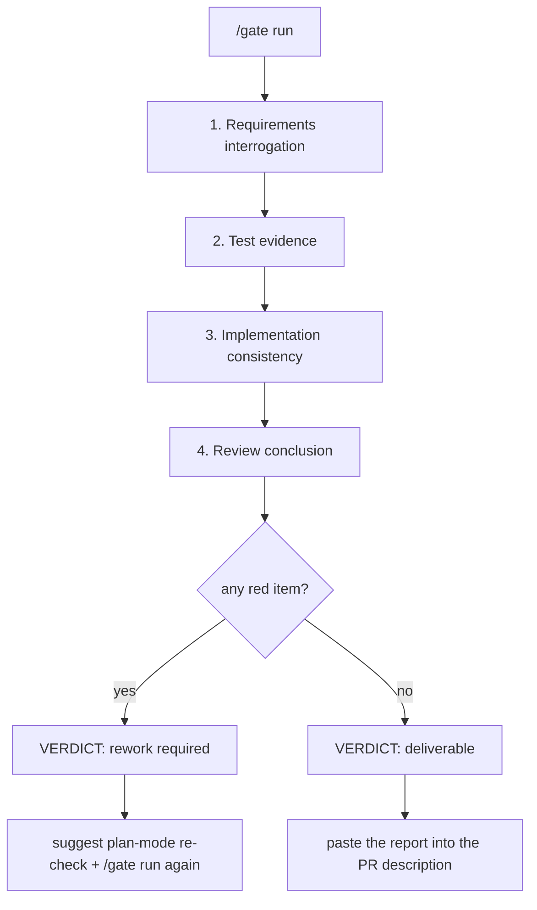

# dsh-doublecheck

> **O portão de qualidade de entrega para o DeepSeek Harness: interrogue os requisitos, teste a implementação, comprove a entrega — e então controle a passagem com uma decisão de entregável / retrabalho necessário.**

[](https://github.com/PerryLink/dsh-doublecheck/releases)
[](https://www.npmjs.com/package/dsh-doublecheck)
[](https://www.npmjs.com/package/dsh-doublecheck)
[](LICENSE)
[](https://github.com/topics/dsh-plugin)
[](https://github.com/PerryLink/dsh-doublecheck/actions/workflows/ci.yml)

Um **bundle de disciplina de engenharia e painel de portão de qualidade de entrega** para o [DeepSeek Harness](https://github.com/deepseek-ai/deepseek-harness). Agentes adoram começar a codar; requisitos odeiam ser presumidos. O `dsh-doublecheck` instala um ciclo de disciplina que faz o agente **interrogar os requisitos antes da primeira edição e comprovar a entrega em vez de afirmá-la** — e um **painel de portão de entrega** que agrega a interrogação de requisitos, a evidência de testes, a consistência diff↔requisito e uma conclusão de revisão em uma única decisão de **entregável / retrabalho necessário**, renderizada como um relatório markdown pronto para PR. Reimplementado de forma nativa nos pontos de extensão do próprio DSH (registro de skills, pipeline de políticas de ferramentas, seam de aprovação, seams de subagente e workflow, comandos, projeções de sessão, namespace de configurações, modo plano), sem arquivos de prompt emprestados. Testado contra DSH `0.1.0-rc.6`.

A metodologia é inspirada em [obra/superpowers](https://github.com/obra/superpowers) e [TimothyVang/Grill-me](https://github.com/TimothyVang/Grill-me). Todos os prompts, termos, exemplos e arquivos deste pacote foram escritos do zero — nada é copiado de nenhum dos dois projetos.

## Por quê

- Tarefas vagas produzem software errado. Um pedido curto («faz uma função pra mim») esconde seis decisões em aberto; hoje o agente chuta todas elas e você paga pelo chute.
- Times disciplinados fazem isso com humanos: revisão de requisitos → teste que falha → teste que passa → autorrevisão → comprovação de entrega. Agentes merecem o mesmo ciclo, imposto pelo harness, não pela boa vontade.
- Publicar exige uma decisão, não um palpite. O portão de entrega transforma a evidência do ciclo em um único veredito de **entregável / retrabalho necessário** com itens vermelhos e sugestões de retrabalho — o painel que uma plataforma de avaliação cola na descrição do PR.

## O ciclo de disciplina

```
grill ──▶ design ──▶ red ──▶ green ──▶ review ──▶ verify
  │         │
  │      (v0.1)        (v0.2+)        (v0.3)         (v0.4)
  │
  └─ fornalha de requisitos: seis dimensões, portão de consenso,
     spec estruturado gravado na sessão e no workspace
```

| Etapa | Significado | Status |
|---|---|---|
| **grill** | Interrogar as seis dimensões de requisitos; recusar implementar até o consenso. | ✅ v0.1 |
| **design** | Spec registrado via `doublecheck_spec`. | ✅ v0.1 |
| **red** | Um teste que falha comprova a lacuna; edições de implementação precisam dele no registro. | ✅ v0.2 |
| **green** | Um teste que passa após as edições fecha o ciclo. | ✅ v0.2 |
| **review** | Um crítico adversário bifurcado audita a entrega contra o spec. | ✅ v0.3 |
| **verify** | `doublecheck_report` + um workflow de verificação por dimensão comprovam a entrega. | ✅ v0.4 |

## O portão de entrega (v0.7)

O portão é o **front end productizado do ciclo**: ele agrega a evidência durável da sessão em uma checklist configurável de quatro fases e produz uma única decisão binária. Cada fase dobra apenas o log da sessão (o replay É o estado), então uma execução do portão se re-deriva de forma idêntica após retomada ou bifurcação.



| Fase | Verificações | Fonte de evidência | Custo de modelo |
|---|---|---|---|
| **Interrogação de requisitos** | Checklist configurável de perguntas-chave, confirmada item a item (seis perguntas de dimensão do spec por padrão). | `doublecheck_spec` registrado + chamadas `ask_user_question`. | nenhum |
| **Evidência de testes** | Cor da última execução, execuções que falham após green, limite de cobertura opcional. | Execuções de teste de shell no log da sessão (`[exit code: N]`, percentuais de cobertura). | nenhum |
| **Consistência da implementação** | Mapeamento diff ↔ requisito: toda edição deve servir a uma dimensão do spec. | Revisor bifurcado local (achados estruturados, ferramentas somente leitura). | um subagente |
| **Conclusão da revisão** | O veredito de entrega. `engine: auto` consome os registros de veredito duráveis do **dsh-auto-review** quando presentes e degrada para o revisor local caso contrário; `engine: local` usa sempre o revisor local. | Eventos `autoReview/verdict` / `autoReview/rejection`, ou o revisor bifurcado local. | um subagente (local) |

- **Luzes vermelhas** são verificações que falharam: um spec ausente, uma última execução de teste que falha, cobertura abaixo do mínimo, uma edição sem mapeamento, uma chamada de engine rejeitada, achados de revisão blocker/major. Cada item vermelho traz uma sugestão de retrabalho.
- **Avisos e pulos nunca mudam a decisão**: uma revisão pulada mantém o relatório honesto ("not reviewed") sem inventar uma luz vermelha — fail-closed para afirmações, nunca para evidência.
- **Modo plano e aprovações**: um veredito de retrabalho sugere reabrir o trabalho em modo plano (no banner do relatório, no painel `/gate status` e no aviso de turno de uma vez por sessão). Os portões de disciplina abaixo mantêm sua aplicação na cadeia de aprovação `warn`/`block`; o portão em si é consultivo.
- **À prova de auditoria por construção**: os relatórios registram apenas contagens, ids e vereditos — sem conteúdos de arquivo nem texto de sessão. Os textos de achados produzidos pelo modelo passam por um redator de segredos (chaves de nuvem, tokens, blocos de chave privada, atribuições de senha, sequências longas hex/base64) antes de serem armazenados ou exibidos. O estado assentado trafega pelo evento de sessão durável `doublecheck/gate` e pelo `gate-report.md` do workspace.

### Relatório de exemplo

`/gate run` devolve este markdown — cole-o na descrição de um PR:

````markdown
# Delivery gate report

> **Verdict: rework required** — 2 red item(s)
> The gate is red. Re-open the work in plan mode to re-check the open items before delivering.

## 1. Requirements interrogation — PASS
- [✔] **What outcome must the delivery produce?** — spec dimension "goal" committed
- [✔] **What is in scope, and what is out of scope?** — spec dimension "scope" committed
- [✔] **Which observable checks prove the work is done?** — spec dimension "acceptanceCriteria" committed
- [✔] **What can go wrong, and what is the correct behavior in each case?** — spec dimension "failureModes" committed
- [✔] **What is traded when goals conflict; what is optional?** — spec dimension "priorities" committed
- [✔] **What does the user explicitly not want?** — spec dimension "nonGoals" committed

## 2. Test evidence — FAIL
- [✔] **passing test run** — latest test run passed
- [✔] **failing cases after green** — 0 failing run(s) after green (allowed: 0)
- [✖] **coverage evidence** — 61% coverage below the 80% minimum — rework: raise coverage above the configured minimum

## 3. Implementation consistency — WARN
- [⚠] **[minor] src/telemetry.ts touched without a requirement** — [minor] the edit adds a metric no spec dimension covers

## 4. Review conclusion — PASS
- [✔] **dsh-auto-review conclusion** — 3 call(s) approved by dsh-auto-review (latest risk: low)

## Red items
1. **tests/coverage** — 61% coverage below the 80% minimum — *rework: raise coverage above the configured minimum*
2. **consistency/finding-1** — [minor] the edit adds a metric no spec dimension covers — *rework: src/telemetry.ts touched without a requirement*

## Audit
- review engine: dsh-auto-review
- generated at: 2026-08-14T12:00:00.000Z
- counts, ids, and verdicts only: no file contents or session text are embedded, and recognized secrets are redacted.
````

### Dependência fraca do dsh-auto-review

O portão integra-se com o [dsh-auto-review](https://github.com/PerryLink/dsh-auto-review) como **"usar o engine quando ele estiver lá"**, nunca como uma dependência dura:

- `review.engine: auto` (padrão) dobra os registros de veredito duráveis do engine (`autoReview/verdict` / `autoReview/rejection`) a partir do log da sessão — as conclusões reais do engine sobre as revisões da cadeia de aprovação desta sessão. Chamadas rejeitadas ou de alto risco viram itens vermelhos.
- Sem registros (o engine não está instalado, ou nada o acionou nesta sessão) → a fase degrada para o revisor bifurcado local e nomeia o motivo numa verificação de aviso: `dsh-auto-review is not installed` / `dsh-auto-review is installed but has no verdict records in this session`.
- O portão **nunca sintetiza pedidos de aprovação**: essa cadeia pode chegar a um humano. Os próprios registros do engine são a evidência; `engine: local` a ignora por completo.

### Superfície de configurações

A checklist plugável é config validada por Schema (`gate.*` na linha guard) e ainda é registrada como o **namespace de configurações `doublecheck.gate`** (`expose: true`, `applies: restart`) quando o serviço de configurações do harness está montado — assim UIs capazes de configurações podem ler e editar a checklist sem editar um profile à mão.

## Recursos

- 🔥 **Skill `grill-requirements`** — um skill empacotado no formato Agent Skills que interroga a tarefa em seis dimensões (**objetivo, escopo, critérios de aceite, modos de falha, prioridades, não-objetivos**) usando a UI nativa `ask_user_question` do DSH, recusa escrever código até o consenso e registra o contrato.
- 🧰 **Skills de etapa para o ciclo inteiro** — `red-green-tdd` (escreva o teste que falha, rode red, implemente, rode green), `delivery-review` (autorrevisão adversária contra o spec uma vez em green) e `delivery-proof` (consolide a evidência no relatório de entrega e passe pelo portão de entrega antes de declarar concluído) juntam-se ao `grill-requirements`: as seis etapas têm orientação de modelo, não só a primeira.
- 📜 **Ferramenta `doublecheck_spec`** — grava o spec acordado no log da sessão e escreve uma cópia em markdown no workspace, para o contrato sobreviver à conversa. Dimensões vazias ou só com espaços são rejeitadas no commit (v0.6): o grill precisa assentar as seis antes de o spec contar.
- 🔄 **Re-grill na mudança de tarefa** — um spec registrado cobre a própria tarefa: um novo pedido direto do usuário após o último spec reabre o portão grill para esse follow-up, em vez de herdar o contrato anterior em silêncio.
- 🛡️ **Guard de disciplina** — um portão suave no pipeline de políticas de ferramentas. Tarefa vaga + sem spec + rumo a `edit`/`write` → **lembrar**, **pedir aprovação humana** ou **bloquear**, conforme `intensity`.
- 🟥🟩 **Portões de evidência red/green** (`modules.tdd`) — verificações duras sobre o log da sessão: uma edição de implementação exige um **teste que falha registrado** desde o último teste que passa (escrever arquivos de teste é sempre permitido — é assim que o passo red acontece), e um turno que termina com edições mas sem nenhum teste que passa recebe um lembrete green injetado. Ferramentas guard personalizadas funcionam de cara: os portões leem as chaves de argumento `file_path` e `path`, e uma chamada que não nomeia arquivo nenhum não é tratada como edição de implementação.
- 👁️ **Revisão adversária** (`modules.adversary`) — assim que a entrega chega ao green, um subagente crítico bifurcado (seam nativo de subagentes do DSH, provider `fork` por padrão) audita a sessão contra o spec registrado com postura adversária e devolve achados estruturados, ordenados com blockers primeiro. `remind` injeta a crítica; `warn`/`block` ainda direcionam uma rodada para o modelo responder aos achados. `adversaryModel` roteia o crítico para um modelo separado; a allowlist de ferramentas do crítico é somente leitura por padrão. Os achados trafegam pela fonte de mensagens durável `doublecheck-review`. A revisão se rearma quando o crítico termina: edições de implementação após o último registro de revisão disparam outra rodada, e cancelar o turno aborta o crítico em voo.
- 🚦 **Portão de qualidade de entrega** (v0.7) — a checklist configurável de quatro fases acima: interrogação de requisitos (perguntas-chave confirmadas item a item), evidência de testes (cor da execução, casos que falham, limite de cobertura), consistência da implementação (mapeamento diff ↔ requisito por um revisor local) e a conclusão da revisão (registros de veredito do dsh-auto-review com uma degradação local honesta). Uma única decisão de **entregável / retrabalho necessário**, itens vermelhos com sugestões de retrabalho, uma sugestão de rechecagem em modo plano no vermelho, um aviso vermelho no limite do turno (curto, uma vez por sessão) e o relatório markdown pronto para PR.
- ⌨️ **Comando de sessão `/gate`** — `status` renderiza o progresso ao vivo da checklist (fases determinísticas dobram na hora; fases de revisor mostram a última execução), `run` assenta o portão completo e devolve o relatório, `config` renderiza a checklist e os limites efetivos.
- 🌐 **Superfície de modelo totalmente localizada** — toda string visível ao modelo que o pacote injeta ou responde (lembretes, feedback de negação/consulta, direcionamento de revisão, avisos de portão, avisos de troca, respostas do `/doublecheck` e `/gate`, e os prompts de tarefa do revisor) respeita `language: 'en' | 'zh'`; os documentos spec/report/gate do workspace mantêm seus cabeçalhos estáveis em inglês e seus ids de auditoria.
- 📊 **Relatório doublecheck + workflow de verificação** (`doublecheck_report`, v0.4) — consolida a evidência de disciplina da sessão (spec, cronologia red/green, achados da revisão, edições) em um relatório de entrega com um veredito derivado (`grill → draft → red → green → objections/verified → proven/challenged/unverified`), gravado no workspace. Com `verify`, os verificadores por dimensão rodam pelo seam de workflow do DSH (`verifyMode: all` lança um verificador paralelo por dimensão; `single` executa um combinado) e os vereditos se dobram no relatório — `proven` exige um veredito para cada dimensão.
- 🚦 **Portão de entrega** — no limite do turno, uma entrega que chegou ao green sem `doublecheck_report` registrado recebe um lembrete de relatório esperado antes de declarar concluído; um relatório bem-sucedido avança a etapa para `verify`.
- 🔁 **Estado durável** — todo artefato visível ao modelo (spec, lembretes, feedback de negação, achados da revisão, execuções do portão, o interruptor `/doublecheck on|off`) fica no log da sessão; as decisões dos portões derivam só do log (`tool/call` + `tool/result`, incluindo os sub-despachos do Code Mode), então sessões retomadas ou bifurcadas se comportam igual. `remindOnce` também é durável: uma sessão que já recebeu um lembrete nunca o recebe duas vezes, mesmo após reiniciar. A dobra do interruptor viaja num snapshot incremental, então sessões longas ficam em O(eventos novos) por chamada de ferramenta.
- ⌨️ **Comando de sessão `/doublecheck`** — `status` informa o interruptor efetivo, os módulos configurados, a intensidade de aplicação, os fatos de etapa dobrados e o último veredito do portão; `report` dobra o relatório de entrega na hora; `on|off` grava o override durável `doublecheck/state` e injeta um aviso de troca.
- 📚 **Ferramenta `doublecheck_skills`** — lista e carrega os skills do pacote pelo seam oficial do registro de skills.
- 🔒 **Overlay estrito** — `strict.patch.yml` liga todos os portões com intensidade `block` e habilita o requisito de cobertura (80%) numa única camada de patch (vem com o pacote).
- 🧩 **Companheiro invariante independente** — a linha `dsh-doublecheck/invariant` é uma exportação de subrota real: relata contradições do caminho de escrita do pacote (forma spec/report/review/gate e consistência de veredito) pelo registro `invariants` do host sem carregar o guard.

## Demo

Uma execução headless real com `intensity: block` e todos os portões habilitados, transcrição gravada a partir do log de sessão durável:

```sh
dsh --profile demo headless "把这个项目里最慢的代码直接改快，别问我任何问题，直接改文件。"
```

1. **grill** bloqueia a primeira edição — nenhum spec registrado:
   `Error: Blocked by the dsh-doublecheck requirements guard: the task statement is vague and no doublecheck_spec exists for this session.`
2. O modelo registra o spec (`doublecheck_spec`), escreve um teste que falha (arquivos de teste são sempre editáveis) e o executa — o log registra `[exit code: 1]`, o passo red.
3. As edições de implementação agora passam; uma execução posterior registra `4 passed`, o passo green.
4. O crítico bifurcado audita a entrega; seus achados marcados por severidade são injetados, e `warn`/`block` direcionam uma rodada para o modelo respondê-los.
5. `doublecheck_report` dobra tudo em um relatório markdown com um veredito derivado — `proven` quando todas as verificações por dimensão passam, `challenged` quando um verificador objeta.
6. **`/gate run`** assenta a checklist de quatro fases na decisão de **entregável / retrabalho necessário**; um veredito vermelho lista os itens vermelhos com sugestões de retrabalho e sugere uma rechecagem em modo plano.

## Instalação

```sh
dsh plugin --profile <name> add dsh-doublecheck
dsh --profile <name> --dump-config   # espere uma camada "# == dsh-doublecheck"
```

As duas linhas de plugin ativam automaticamente com o profile. Instalação por tarball também funciona:

```sh
pnpm pack
dsh plugin --profile <name> add ./dsh-doublecheck-0.7.0.tgz
```

Instalação por git dispensa npm:

```sh
dsh plugin --profile <name> add "github:PerryLink/dsh-doublecheck#v0.7.0"
```

Para um modo estrito sem configuração (todos os portões ligados, intensidade `block`, cobertura do portão exigida), aplique o overlay incluído por cima do bundle patch:

```sh
dsh --profile <name> --patch ./node_modules/dsh-doublecheck/strict.patch.yml
```

## Desinstalação

```sh
dsh plugin --profile <name> remove dsh-doublecheck
```

Para manter o pacote instalado mas desativar uma linha: sobrescreva-a por id com `disabled: true` no `cordis.patch.yml` do profile (`doublecheck-grill` / `doublecheck-guard`).

## Compatibilidade

- Verificado contra os peers `0.1.0-rc.6` (`@deepseek-ai/cordis ^4.0.1`); última verificação em 2026-08-14 (Windows + Node 22).
- As escritas de sessão duráveis (`/doublecheck on|off` → `doublecheck/state`, `/gate run` → `doublecheck/gate`) exigem a superfície de escrita `ignorable` do host (harness posterior ao rc.6): hosts rc.6 ignoram o options bag e o evento permanece required-on-read, então a troca fica em memória e o registro do portão vive apenas no resultado do comando + arquivo do workspace, até atualizar o harness.
- O namespace de configurações `doublecheck.gate` registra apenas quando o serviço de configurações do harness está montado; profiles sem ele simplesmente não têm superfície de configurações.
- A linha `plan mode:` de `/gate status` lê o serviço opcional `ctx.planMode`; profiles sem ele mostram `unknown`.

## Permissões e dados

- **Lê**: apenas em processo o log de sessão (`tool/call` / `tool/result` / `tool/code-dispatch`, fontes `user/message` injetadas e os registros de veredito estrangeiros `autoReview/*`); o estado opcional do serviço de modo plano.
- **Escreve**: `doublecheck-spec.md`, `doublecheck-report.md` e `gate-report.md` no workspace da sessão (caminhos configuráveis), via o seam `ctx.fs`; os eventos de sessão duráveis `doublecheck/state` e `doublecheck/gate`.
- **Chamadas ao modelo**: as fases de consistência e revisão local do portão (um subagente cada por `/gate run`), a revisão adversária opcional (`modules.adversary`, off por padrão) e o workflow de verificação de `doublecheck_report` (on por padrão) iniciam subagentes; nada mais chama o modelo ou a rede.
- **Nunca toca**: credenciais, variáveis de ambiente ou arquivos fora do workspace da sessão. Relatórios do portão contêm apenas contagens, ids e vereditos; segredos reconhecidos nos textos do revisor são redigidos antes do armazenamento ou exibição.

## Resolução de problemas

| Sintoma | Causa e solução |
|---|---|
| Sem camada `# == dsh-doublecheck` no `--dump-config` | Falta o bundle patch ou uma linha está `disabled` — confira a ordem dos patches do profile e os ids das linhas. |
| Os gates nunca reagem | Rode `/doublecheck status`: o interruptor da sessão pode estar desligado, ou todos os `modules.*` estão false. |
| "Adversary review did not run: the subagents seam is not mounted" | Esta composição de profile não provê subagentes — monte um (composições spine trazem) ou desative `modules.adversary`. |
| `doublecheck_report` mostra `verification: null` | O seam `workflowEngine` está ausente ou o run foi rejeitado/abortado — o relatório diz isso em vez de adivinhar. |
| O relatório diz `unverified` | A verificação rodou mas nem toda dimensão do spec devolveu veredicto — rode de novo com `verify: true`; `proven` exige as seis. |
| `/gate run` mostra `Review conclusion — WARN: dsh-auto-review is not installed` | Degradação esperada: a linha do engine não está neste profile. Instale o `dsh-auto-review`, ou defina `gate.review.engine: local` para pular a detecção. |
| `/gate run` mostra `Implementation consistency — SKIP` | O seam `subagents` está ausente (ou o run expirou) — monte um provider de subagentes; o portão nunca falsifica um veredito. |
| `/gate status` mostra `plan mode: unknown` | O profile não tem serviço de modo plano montado; a sugestão ainda aparece no relatório e no aviso de turno. |
| O registro do portão não está no log da sessão | Este host rc.6 não carimba o marcador `ignorable` — o registro vive apenas no resultado do comando e no `gate-report.md`. |

## Configuração

Sobrescreva qualquer linha **por id** no `cordis.patch.yml` do profile. Um patch substitui toda a config da linha — reescreva todas as chaves:

```yaml
- id: doublecheck-grill
  config:
    specFile: 'specs/doublecheck-spec.md'   # default: 'doublecheck-spec.md'
    reportFile: 'specs/doublecheck-report.md'   # default: 'doublecheck-report.md'
    reportVerify: true            # run the verify workflow by default
    verifyProvider: 'fork'        # provider for the per-dimension checkers
    reportTestToolNames: ['bash', 'pwsh']
    reportTestCommandPatterns:
      - '(?:^|[;&|]\s*)(?:(?:pnpm|npm|npx|yarn|bun)(?:\s+run)?\s+(?:test|vitest|jest|mocha)(?:\s|$))'
      - '(?:^|[;&|]\s*)(?:(?:pytest|go\s+test|cargo\s+test|make\s+test|ctest)(?:\s|$))'
      - '(?:^|[;&|]\s*)(?:node\s+--test(?:\s|$))'
      - '(?:^|[;&|]\s*)(?:deno\s+test|uv\s+run\s+pytest)(?:\s|$)'
    reportMutationTools: ['edit', 'write']
    reportTestFilePatterns:
      - '(^|[\\/])(tests?|__tests__|specs?)([\\/]|$)'
      - '\\.(test|spec)\\.[A-Za-z0-9]+$'

- id: doublecheck-guard
  config:
    intensity: warn
    modules:
      grill: true
      tdd: true         # red/green evidence gates (v0.2)
      adversary: true   # forked critic review (v0.3)
    adversaryModel: null            # or e.g. 'deepseek-v4-pro' for a separate critic model
    adversaryProvider: 'fork'       # subagent provider the critic runs on
    adversaryMaxFindings: 5         # findings cap injected into the session
    adversaryTools: ['read', 'glob', 'grep']   # critic tool allowlist (read-only)
    adversaryTimeoutMs: 120000      # hard budget for one critic run
    guardTools: ['edit', 'write']
    vagueTaskMaxChars: 200
    remindOnce: true
    testToolNames: ['bash', 'pwsh']
    testCommandPatterns:
      - '(?:^|[;&|]\s*)(?:(?:pnpm|npm|npx|yarn|bun)(?:\s+run)?\s+(?:test|vitest|jest|mocha)(?:\s|$))'
      - '(?:^|[;&|]\s*)(?:(?:pytest|go\s+test|cargo\s+test|make\s+test|ctest)(?:\s|$))'
      - '(?:^|[;&|]\s*)(?:node\s+--test(?:\s|$))'
      - '(?:^|[;&|]\s*)(?:deno\s+test|uv\s+run\s+pytest)(?:\s|$)'
    testFilePatterns:
      - '(^|[\\/])(tests?|__tests__|specs?)([\\/]|$)'
      - '\\.(test|spec)\\.[A-Za-z0-9]+$'
    gate:
      enabled: true
      planSuggestion: true
      reportFile: 'gate-report.md'
      requirements:
        enabled: true
        checklist:
          - { id: goal, question: 'What outcome must the delivery produce?', specDimension: goal, required: true }
          - { id: scope, question: 'What is in scope, and what is out of scope?', specDimension: scope, required: true }
          - { id: acceptance, question: 'Which observable checks prove the work is done?', specDimension: acceptanceCriteria, required: true }
          - { id: failureModes, question: 'What can go wrong, and what is the correct behavior in each case?', specDimension: failureModes, required: true }
          - { id: priorities, question: 'What is traded when goals conflict; what is optional?', specDimension: priorities, required: true }
          - { id: nonGoals, question: 'What does the user explicitly not want?', specDimension: nonGoals, required: true }
        minConfirmed: 6
        interrogateTool: 'ask_user_question'
      tests:
        enabled: true
        requirePassingRun: true
        allowFailingRuns: 0
        requireCoverage: false
        minCoveragePct: 80
        coveragePattern: 'coverage[^\d]{0,40}(\d+(?:\.\d+)?)\s*%'
      consistency:
        enabled: true
        provider: fork
        model: null
        tools: ['read', 'glob', 'grep']
        timeoutMs: 120000
        maxFindings: 5
      review:
        enabled: true
        engine: auto          # auto = dsh-auto-review verdict records, else local
        provider: fork
        model: null
        tools: ['read', 'glob', 'grep']
        timeoutMs: 120000
        maxFindings: 5
```

O `strict.patch.yml` incluído é exatamente esta linha guard com `intensity: block`, todos os módulos ligados e o requisito de cobertura do portão habilitado — aplique-o como camada de patch depois do bundle patch para o modo estrito sem editar um profile à mão.

### `intensity`

| Valor | Comportamento diante de um `edit`/`write` controlado pelo portão |
|---|---|
| `remind` (padrão) | A chamada prossegue; um lembrete viaja no contexto do resultado para a próxima requisição do modelo. |
| `warn` | A chamada fica retida aguardando aprovação humana única pelo seam de aprovação (nega quando não há canal). |
| `block` | A chamada é negada com feedback que orienta o modelo a corrigir a disciplina primeiro. |

### Ajustes

| Chave | Padrão | Significado |
|---|---|---|
| `modules.grill` | `true` | `false` desativa o portão grill. O interruptor dos skills/ferramentas grill é o flag `disabled` da linha deles. |
| `modules.tdd` | `true` | `true` ativa os portões de evidência red/green (v0.2); ativado por padrão desde v0.5. |
| `modules.adversary` | `false` | `true` ativa a revisão do crítico bifurcado no green (v0.3); usa o seam `ctx.subagents` — um seam ausente se resolve como um aviso «indisponível». |
| `enableByDefault` | `true` | Interruptor mestre para sessões sem um registro `/doublecheck on|off`. |
| `language` | `'en'` | Idioma da prosa injetada de lembrete/negação/revisão/portão (`en` / `zh`). |
| `guardTools` | `['edit', 'write']` | Nomes de ferramentas de mutação que o guard vigia. |
| `vagueTaskMaxChars` | `200` | Tarefas mais longas nunca são tratadas como vagas. Tarefas breves que citam arquivo, caminho, URL, palavra-chave com sublinhado ou palavra-chave hifenizada são concretas. |
| `remindOnce` | `true` | Injetar o lembrete de cada portão no máximo uma vez por sessão — durável entre reinícios (dobrado do log). |
| `testToolNames` | `['bash', 'pwsh']` | Nomes de ferramentas de shell que podem executar testes. |
| `testCommandPatterns` | *(pnpm/npm/yarn/bun test, pytest, go/cargo/make test, node --test, deno test, uv run pytest)* | Expressões regulares com as quais um comando deve coincidir para contar como execução de teste. |
| `testFilePatterns` | *(diretórios de teste, `*.test.*` / `*.spec.*`)* | Expressões regulares que identificam arquivos de teste — sempre editáveis, isentos do portão red. |
| `adversaryModel` | `null` | Rota do modelo crítico; `null` = o modelo principal se autorrevisa. |
| `adversaryProvider` | `'fork'` | Nome do provider de subagentes onde o crítico roda. |
| `adversaryMaxFindings` | `5` | Teto de achados (1–20) injetados na sessão. |
| `adversaryTools` | `['read', 'glob', 'grep']` | Allowlist de ferramentas do crítico; mantenha somente leitura. |
| `adversaryTimeoutMs` | `120000` | Orçamento de tempo rígido para uma execução do crítico. |

Configuração errada falha em voz alta: uma regex inválida, uma lista de nomes vazia ou duplicada, ou um teto de achados fora do intervalo lança erro no carregamento, em vez de não fazer nada em silêncio. Um crítico que não consegue rodar (seam ausente, falha do provider, timeout) se resolve como um aviso honesto «indisponível» na sessão.

### Controles do relatório (linha grill)

| Chave | Padrão | Significado |
|---|---|---|
| `reportFile` | `'doublecheck-report.md'` | Arquivo do workspace que recebe o markdown do relatório. |
| `reportVerify` | `true` | Padrão para o flag `verify` da ferramenta. |
| `verifyProvider` | `'fork'` | Provider de subagentes onde os verificadores por dimensão rodam. |
| `verifyMode` | `'all'` | `all` = um verificador paralelo por dimensão; `single` = um verificador combinado (um subagente, mais barato). |
| `reportTestToolNames` / `reportTestCommandPatterns` | *(same defaults as the guard row)* | Classificação de execuções de teste com escopo de relatório. |
| `reportMutationTools` / `reportTestFilePatterns` | *(same defaults as the guard row)* | Classificação de edições de implementação com escopo de relatório. |

Os controles de classificação do relatório são independentes dos do guard: a aplicação do portão e a dobra do relatório podem ser ajustados separadamente sem que um mude silenciosamente o outro. A verificação degrada honestamente: um seam `workflowEngine` ausente ou uma execução rejeitada deixa `verification: null` e o markdown diz isso.

### Controles do portão (linha guard)

| Chave | Padrão | Significado |
|---|---|---|
| `gate.enabled` | `true` | Interruptor mestre do painel do portão e do aviso vermelho no limite do turno. |
| `gate.planSuggestion` | `true` | Anexa a sugestão de rechecagem em modo plano aos relatórios e painéis vermelhos. |
| `gate.reportFile` | `'gate-report.md'` | Arquivo do workspace que recebe o relatório do portão. |
| `gate.requirements.enabled` | `true` | `false` pula a fase de requisitos. |
| `gate.requirements.checklist` | *(seis perguntas de dimensão do spec)* | A checklist plugável de perguntas-chave: `{ id, question, specDimension, required }`. `specDimension: null` renderiza como um aviso de confirmação manual; perguntas opcionais que falham são avisos, não luzes vermelhas. |
| `gate.requirements.minConfirmed` | `6` | Mínimo de perguntas obrigatórias que devem passar (1..contagem obrigatória). |
| `gate.requirements.interrogateTool` | `'ask_user_question'` | Nome da ferramenta cujas chamadas contam como evidência de interrogação. |
| `gate.tests.enabled` | `true` | `false` pula a fase de evidência de testes. |
| `gate.tests.requirePassingRun` | `true` | Uma última execução de teste que não passa (ou ausente) é uma luz vermelha. |
| `gate.tests.allowFailingRuns` | `0` | Execuções que falham após o último green permitidas antes do vermelho. |
| `gate.tests.requireCoverage` | `false` | `true` exige evidência de cobertura na saída dos testes. |
| `gate.tests.minCoveragePct` | `80` | Percentual mínimo de cobertura (0–100). |
| `gate.tests.coveragePattern` | `coverage…(\d+…)%` | Regex com um grupo de captura que analisa o percentual de cobertura (compilada sem diferenciar maiúsculas). |
| `gate.consistency.enabled` | `true` | `false` pula a fase de mapeamento diff ↔ requisito. |
| `gate.consistency.provider` / `.model` / `.tools` / `.timeoutMs` / `.maxFindings` | `fork` / `null` / `read,glob,grep` / `120000` / `5` | Os controles do revisor de consistência local (model `null` = modelo principal). |
| `gate.review.enabled` | `true` | `false` pula a conclusão da revisão. |
| `gate.review.engine` | `'auto'` | `auto` = registros de veredito do dsh-auto-review quando presentes, senão o revisor local; `local` = sempre o revisor local. |
| `gate.review.provider` / `.model` / `.tools` / `.timeoutMs` / `.maxFindings` | *(same as consistency)* | Os controles do revisor de revisão local. |

A configuração do portão é validada falhando em voz alta no carregamento (ids duplicados, dimensões de spec desconhecidas, limites fora do intervalo, regex inválidas, listas de ferramentas vazias lançam erro), e a checklist é exposta pelo namespace de configurações `doublecheck.gate` quando o serviço de configurações está montado. O portão nunca sintetiza pedidos de aprovação; os revisores locais são somente leitura por padrão.

## Como funciona (pontos de extensão)

| Contribuição | Mecanismo DSH |
|---|---|
| Skills empacotados | `ctx.skills.registerProvider()` — seam de capacidade de skills, `source: bundled` |
| Ferramenta de catálogo/carga | `ctx.tools.register()` — `doublecheck_skills` |
| Spec + arquivo no workspace | ferramenta `doublecheck_spec` + escrita opcional via `ctx.fs` |
| Portão de requisitos | waterfall `tools/pre-execute` — `allow` / `ask` (seam de aprovação) / `deny` |
| Portão red | waterfall `tools/pre-execute` — verificação dura da evidência de teste falho antes das edições de implementação |
| Injeção de lembrete | waterfall `tools/post-execute` — `additionalContexts` → registrado como `user/message` |
| Portão green | `agent/turn-stopping` serial — injeta um lembrete de conclusão quando as edições carecem de um teste que passa |
| Revisão adversária | `ctx.subagents.start()` — forked critic with structured findings schema, injected at green; `warn`/`block` steer one round |
| Relatório de entrega | `doublecheck_report` tool — session-log fold + workspace markdown |
| Workflow de verificação | `ctx.workflowEngine.start()` — one parallel checker per spec dimension, structured checks |
| Fases determinísticas do portão | folds puros do log da sessão — checklist de perguntas-chave contra o spec registrado; evidência de execução de teste/cobertura |
| Fases de revisor do portão | `ctx.subagents.start()` — mapeador de consistência + revisor local, achados estruturados, ferramentas somente leitura |
| Revisão do engine | folds duráveis `autoReview/verdict` / `autoReview/rejection` + sonda de presença `ctx.commands.list()` (dependência fraca, sem import) |
| Sugestão de modo plano | prosa de relatório/painel + aviso de turno de uma vez por sessão; leitura de `ctx.planMode` para a linha de status (opcional) |
| Comando `/gate` | `ctx.commands.register()` — `status|run|config`; `run` escreve o evento durável `doublecheck/gate` + `gate-report.md` |
| Superfície de configurações | `ctx.settings.register('doublecheck.gate', schema, { expose: true, applies: 'restart' })` quando montado |
| Estado durável | session log fold over `tool/call` + `tool/result` + `tool/code-dispatch` + injected structured sources + `doublecheck/state` + `doublecheck/gate`; model-visible ⟺ logged |
| Comando de sessão | `ctx.commands.register()` — `/doublecheck status|report|on|off`; `on|off` escreve o evento de sessão durável `doublecheck/state` |
| Projeção de sessão | registro `sessionProjections` — a visão `doublecheck` agora carrega `gateVerdict` + `gateRedCount` (stateVersion 2) |
| Eventos internos | `doublecheck/spec`, `doublecheck/reminder`, `doublecheck/review`, `doublecheck/report`, `doublecheck/gate` (typed via declaration merging, `@mode emit`) |

Sem mudanças no agent-loop. Todo registro é um `ctx.effect` / `ctx.on` / `register()` de serviço reversível.

## O que o modelo vê

- O skill `grill-requirements` entra no catálogo de skills da sessão e carrega pela ferramenta integrada `skill` (ou `doublecheck_skills`).
- `ask_user_question` continua sendo a forma nativa do DSH de perguntar ao usuário; o skill só coreografa (e em headless sem provider degrada para perguntas em prosa).
- Os lembretes chegam como contexto `{kind:'plugin'}`, então as UIs de transcrição os exibem como metadados de injeção.
- A crítica do adversário chega da mesma forma depois que o crítico se estabelece, com achados marcados por severidade; sob `warn`/`block` o ciclo é direcionado uma rodada para que o modelo os responda.
- `doublecheck_report` devolve o relatório consolidado como resultado de ferramenta (spec, cronologia de testes, revisão, verificação, veredito), então «comprovar a entrega» está a uma chamada de distância.
- O aviso vermelho de portão no turno chega como contexto `{kind:'doublecheck-gate'}` — uma frase curta de declaração de papel mais a contagem de vermelhos e a sugestão de modo plano.
- `/doublecheck` e `/gate` respondem direto na transcrição: `status` mostra o interruptor, os módulos, a intensidade, os fatos de etapa e o último veredito do portão; `report` imprime o relatório dobrado; `on|off` muda o interruptor da sessão; `/gate run` devolve o relatório do portão pronto para PR.

## Comandos de sessão

```
/doublecheck status|report|on|off
/gate status|run|config
```

- `/doublecheck status` — interruptor efetivo (o override durável vence o padrão da config), módulos configurados, intensidade de aplicação, os fatos de etapa dobrados (spec registrado, cor red/green, revisão em registro, contagem de edições) e o último veredito do portão.
- `/doublecheck report` — dobra o relatório de entrega a partir do log da sessão na hora (sem workflow de verificação; `doublecheck_report` é dono desse caminho).
- `/doublecheck on|off` — grava o evento durável `doublecheck/state` (sobrevive a reinício, retomada e bifurcação — o replay É o estado) e injeta um aviso de troca visível ao modelo.
- `/gate status` — o progresso ao vivo da checklist: fases determinísticas dobram na hora, fases de revisor e o veredito mostram a última execução `doublecheck/gate`, mais o estado de modo plano.
- `/gate run` — assenta a checklist completa de quatro fases (folds determinísticos + dois forks de revisor local em paralelo; os registros de veredito do engine quando presentes), grava o evento durável `doublecheck/gate` e `gate-report.md`, e devolve o markdown do relatório.
- `/gate config` — renderiza a checklist efetiva, os limites e os controles do revisor.

Todas as respostas do comando respeitam o ajuste `language` da linha guard; os documentos de relatório mantêm seus cabeçalhos estáveis em inglês e seus ids de auditoria.

## Roadmap

O ciclo de disciplina e o portão de entrega ambos embarcam: **grill → design → red → green → review → verify** (v0.1 → v0.6) mais o **portão de qualidade de quatro fases com a decisão de entregável/retrabalho** (v0.7). Fixtures de regressão com transcrições reais fixam as formas dos eventos duráveis (`tests/fixtures/`). Trabalho futuro: uma aba de configurações na Web UI e um selo de portão para a projeção `doublecheck`, formatação de relatório mais rica e a semeadura de spec entre sessões a partir do arquivo do workspace.

## Desenvolvimento

```sh
pnpm install --ignore-workspace
pnpm run typecheck
pnpm run lint
pnpm run test
pnpm run build
```

## Agradecimentos

Metodologia inspirada em [obra/superpowers](https://github.com/obra/superpowers) (disciplina de engenharia estilo TDD) e [TimothyVang/Grill-me](https://github.com/TimothyVang/Grill-me) (interrogar requisitos antes de implementar). Este pacote é uma implementação original: nenhum texto, prompt ou arquivo de nenhum dos dois projetos foi copiado.

## Contribuidores

- [PerryLink](https://github.com/PerryLink) — autor e mantenedor: o ciclo de disciplina v0.1 → v0.7 e o portão de entrega, a documentação em cinco idiomas, o pipeline de CI/publicação e as submissões ao ecossistema ([awesome-dsh-plugin#451](https://github.com/awesome-dsh-plugin/awesome-dsh-plugin/pull/451), [awesome-dsh-plugins#147](https://github.com/AdamPlatin123/awesome-dsh-plugins/pull/147), [awesome-deepseek-harness#179](https://github.com/0xsline/awesome-deepseek-harness/pull/179), [bruc3van/awesome-dsh-plugin#36](https://github.com/bruc3van/awesome-dsh-plugin/pull/36), [dsh-hub-workshop#13](https://github.com/omdsh-dev/dsh-hub-workshop/issues/13)/[#19](https://github.com/omdsh-dev/dsh-hub-workshop/pull/19)).

Issues, pull requests e Discussions são bem-vindos — os pontos de entrada estão no início deste documento.

## Família de Plugins DSH da PerryLink

Este projeto é um dos [15 plugins de DeepSeek Harness](https://github.com/PerryLink) mantidos por [PerryLink](https://github.com/PerryLink). Se este ajuda você, os outros provavelmente também:

| Plugin | Uma linha |
|---|---|
| [dsh-mcp-panel](https://github.com/PerryLink/dsh-mcp-panel) | Painel de runtime MCP somente leitura: comando /mcp + aba de Configurações com status, ferramentas e erros |
| **[dsh-doublecheck](https://github.com/PerryLink/dsh-doublecheck)** | Guard de disciplina de engenharia + portão de qualidade de entrega: grill de requisitos, portões de teste, revisão adversária, painel entregável/retrabalho do /gate |
| [dsh-background-agents](https://github.com/PerryLink/dsh-background-agents) | Agentes filhos em segundo plano duráveis com sidebar na Web UI, mensagens e interrupção |
| [dsh-lsp-actions](https://github.com/PerryLink/dsh-lsp-actions) | Diagnósticos, formatação, autocompletar, ações de código e renomear de LSP sobre language servers |
| [dsh-output-styles](https://github.com/PerryLink/dsh-output-styles) | Troca de estilo de saída em runtime equivalente ao outputStyles do Claude Code |
| [dsh-checkpoint-rewind](https://github.com/PerryLink/dsh-checkpoint-rewind) | Equivalente ao /rewind do Claude Code: snapshots, forks de sessão, restauração em um passo |
| [dsh-permission-rules](https://github.com/PerryLink/dsh-permission-rules) | Regras de permissão declarativas allow/deny/ask estilo Claude Code com auditoria |
| [dsh-auto-review](https://github.com/PerryLink/dsh-auto-review) | Auto-revisão de segundo modelo na cadeia de aprovação, fail-closed por padrão |
| [dsh-memento](https://github.com/PerryLink/dsh-memento) | Memória entre sessões com aprovação: seam ctx.memory + SQLite + ferramenta de memória |
| [dsh-skill-pack-security](https://github.com/PerryLink/dsh-skill-pack-security) | Pacote de skills de auditoria de segurança: varredura de segredos, revisão de dependências e cadeia de suprimentos |
| [dsh-session-pin](https://github.com/PerryLink/dsh-session-pin) | Fixa sessões na sidebar web com ordenação durável |
| [dsh-composer-history](https://github.com/PerryLink/dsh-composer-history) | Histórico de entrada estilo terminal para o compositor web: setas, busca Ctrl+R |
| [dsh-github](https://github.com/PerryLink/dsh-github) | Integração de PR/issues do GitHub para o DSH, toda escrita sujeita a aprovação |
| [dsh-plugin-guide](https://github.com/PerryLink/dsh-plugin-guide) | Base de conhecimento de desenvolvimento de plugins como skill de agente sob demanda |
| [dsh-claude-move](https://github.com/PerryLink/dsh-claude-move) | Migra sessões, memória, skills e CLAUDE.md do Claude Code para o DSH |

## Licença

[Apache-2.0](LICENSE)
