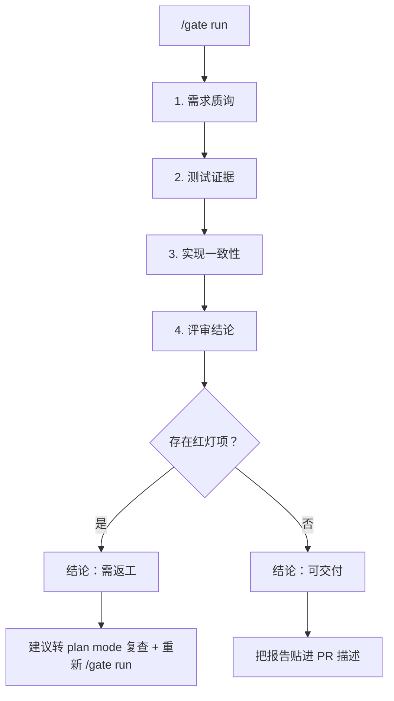

# dsh-doublecheck

> **DeepSeek Harness 的交付质量门禁：先盘问需求，再测试实现，然后证明交付——最后用"可交付/需返工"决策把关交接。**

[](https://github.com/PerryLink/dsh-doublecheck/releases)
[](https://www.npmjs.com/package/dsh-doublecheck)
[](https://www.npmjs.com/package/dsh-doublecheck)
[](LICENSE)
[](https://github.com/topics/dsh-plugin)
[](https://github.com/PerryLink/dsh-doublecheck/actions/workflows/ci.yml)

面向 [DeepSeek Harness](https://github.com/deepseek-ai/deepseek-harness) 的**工程纪律套件 + 交付质量门禁面板**。智能体总想直接开写；需求不喜欢被假设。`dsh-doublecheck` 装上一套纪律循环，让智能体**在第一次编辑之前先盘问需求，用证据证明交付而不是口头声称**——再加上一块**交付门禁面板**：聚合需求质询、测试证据、diff↔需求一致性、评审结论，输出唯一的**可交付 / 需返工**决策，并渲染成可以直接贴进 PR 描述的 Markdown 报告。全部基于 DSH 原生扩展点重新实现（技能注册表、工具策略管线、审批 seam、子代理与工作流 seam、命令、会话投影、设置命名空间、plan mode），不借用别人的提示词文件。已针对 DSH `0.1.0-rc.6` 实测。

方法论受 [obra/superpowers](https://github.com/obra/superpowers) 与 [TimothyVang/Grill-me](https://github.com/TimothyVang/Grill-me) 启发。本包中每一段提示词、术语、示例和文件均为原创——未从上述任一项目复制任何内容。

## 为什么需要它

- 模糊的任务产出错误的软件。一句简短请求（"帮我做一个功能"）背后藏着六个未敲定的决策；智能体现在把它们全猜一遍，然后让你为这些猜测买单。
- 有纪律的团队由人执行这套流程：需求评审 → 失败测试 → 通过测试 → 自审 → 交付证明。智能体值得拥有同样的循环，而且由 harness 强制，不靠玄学。
- 交付需要一个决策，而不是一种感觉。交付门禁把循环中的证据收敛成一个**可交付 / 需返工**结论，附带红灯项与返工建议——这就是评测平台贴进 PR 描述的那块面板。

## 纪律循环

```
grill ──▶ design ──▶ red ──▶ green ──▶ review ──▶ verify
  │         │
  │      (v0.1)        (v0.2+)        (v0.3)         (v0.4)
  │
  └─ 需求熔炉：六个维度、共识门、
     结构化 spec 落入会话与工作区
```

| 阶段 | 含义 | 状态 |
|---|---|---|
| **grill** | 盘问六个需求维度；未达成共识前拒绝实现。 | ✅ v0.1 |
| **design** | 通过 `doublecheck_spec` 提交 spec。 | ✅ v0.1 |
| **red** | 一次失败的测试运行证明缺口；实现编辑需要它留痕。 | ✅ v0.2 |
| **green** | 编辑之后的一次通过测试运行闭环。 | ✅ v0.2 |
| **review** | 一个 fork 出来的对抗式审查者对照 spec 审计交付。 | ✅ v0.3 |
| **verify** | `doublecheck_report` + 逐维度验证工作流证明交付。 | ✅ v0.4 |

## 交付门禁（v0.7）

门禁是这套循环的**产品化前端**：把会话的持久证据聚合成一张可配置的四阶段检查单，输出唯一的二值决策。每个阶段都只折叠会话日志（重放即状态），因此恢复或 fork 之后重新运行会得到完全相同的结果。



| 阶段 | 检查 | 证据来源 | 模型成本 |
|---|---|---|---|
| **需求质询** | 可配置的关键问题清单，逐项确认（默认六个 spec 维度问题）。 | 已提交的 `doublecheck_spec` + `ask_user_question` 调用。 | 无 |
| **测试证据** | 最近一次运行红绿、绿后失败运行数、可选覆盖率阈值。 | 会话日志中的 shell 测试运行（`[exit code: N]`、覆盖率百分比）。 | 无 |
| **实现一致性** | diff ↔ 需求映射：每次编辑都必须服务于某个 spec 维度。 | 本地 fork 评审员（结构化发现，只读工具）。 | 一个子代理 |
| **评审结论** | 交付结论。`engine: auto` 优先消费 **dsh-auto-review** 的持久裁决记录，缺失时降级为本地评审员；`engine: local` 恒用本地评审员。 | `autoReview/verdict` / `autoReview/rejection` 事件，或本地 fork 评审员。 | 一个子代理（本地） |

- **红灯项**就是失败检查：spec 缺失、最近一次测试运行失败、覆盖率低于下限、编辑未映射到需求、引擎裁决拒绝、blocker/major 评审发现。每个红灯项都附带返工建议。
- **警告与跳过不会翻转决策**：跳过评审时报告如实声明"未经评审"，绝不虚构红灯——对"声称" fail-closed，对"证据"永不造假。
- **Plan mode 与审批衔接**：需返工结论会建议转 plan mode 复查（报告横幅、`/gate status` 面板、以及每会话一次的轮次提醒）。下方纪律门保留各自的 `warn`/`block` 审批链强制；门禁本身是建议性的。
- **审计安全由构造保证**：报告只记录计数、id 与结论——不包含文件内容与会话文本。评审产生的文本先经过密钥脱敏（云密钥、token、私钥块、密码赋值、长 hex/base64 串）再存储或展示。结算状态落在持久 `doublecheck/gate` 会话事件与工作区 `gate-report.md` 中。

### 示例报告

`/gate run` 返回的 Markdown——直接贴进 PR 描述：

````markdown
# Delivery gate report

> **Verdict: rework required** — 2 red item(s)
> The gate is red. Re-open the work in plan mode to re-check the open items before delivering.

## 1. Requirements interrogation — PASS
- [✔] **What outcome must the delivery produce?** — spec dimension "goal" committed
- [✔] **What is in scope, and what is out of scope?** — spec dimension "scope" committed
- [✔] **Which observable checks prove the work is done?** — spec dimension "acceptanceCriteria" committed
- [✔] **What can go wrong, and what is the correct behavior in each case?** — spec dimension "failureModes" committed
- [✔] **What is traded when goals conflict; what is optional?** — spec dimension "priorities" committed
- [✔] **What does the user explicitly not want?** — spec dimension "nonGoals" committed

## 2. Test evidence — FAIL
- [✔] **passing test run** — latest test run passed
- [✔] **failing cases after green** — 0 failing run(s) after green (allowed: 0)
- [✖] **coverage evidence** — 61% coverage below the 80% minimum — rework: raise coverage above the configured minimum

## 3. Implementation consistency — WARN
- [⚠] **[minor] src/telemetry.ts touched without a requirement** — [minor] the edit adds a metric no spec dimension covers

## 4. Review conclusion — PASS
- [✔] **dsh-auto-review conclusion** — 3 call(s) approved by dsh-auto-review (latest risk: low)

## Red items
1. **tests/coverage** — 61% coverage below the 80% minimum — *rework: raise coverage above the configured minimum*
2. **consistency/finding-1** — [minor] the edit adds a metric no spec dimension covers — *rework: src/telemetry.ts touched without a requirement*

## Audit
- review engine: dsh-auto-review
- generated at: 2026-08-14T12:00:00.000Z
- counts, ids, and verdicts only: no file contents or session text are embedded, and recognized secrets are redacted.
````

### 与 dsh-auto-review 的弱依赖

门禁与 [dsh-auto-review](https://github.com/PerryLink/dsh-auto-review) 的集成是**"引擎可用则用"**，绝不是硬依赖：

- `review.engine: auto`（默认）从会话日志折叠引擎的持久裁决记录（`autoReview/verdict` / `autoReview/rejection`）——即引擎对本会话审批链审查的真实结论。被拒绝或高风险的调用成为红灯项。
- 没有记录（引擎未安装，或本会话尚无触发它的审批）→ 该阶段降级为本地 fork 评审员，并在警告检查上注明原因：`dsh-auto-review is not installed` / `dsh-auto-review is installed but has no verdict records in this session`。
- 门禁**从不合成审批请求**：那条链可能到达真人。引擎自己的记录就是证据；`engine: local` 则完全跳过引擎。

### 设置面板

可插拔检查单本身就是 Schema 校验的配置（守卫行的 `gate.*`），并且在 harness 设置服务挂载时额外注册为 **`doublecheck.gate` 设置命名空间**（`expose: true`、`applies: restart`）——支持设置的 UI 可以直接读取和编辑检查单，无需手改 profile。

## 功能

- 🔥 **`grill-requirements` 技能** — 内置的 Agent-Skills 格式技能，围绕六个维度（**目标、范围、验收标准、失败模式、优先级、非目标**）盘问任务，使用 DSH 原生 `ask_user_question` UI，在达成共识前拒绝写代码，并记录契约。
- 🧰 **覆盖全循环的阶段技能** — `red-green-tdd`（先写失败测试、跑红、实现、跑绿）、`delivery-review`（变绿后对照 spec 的对抗式自审）、`delivery-proof`（汇总证据成交付报告，并在声称完成前过交付门禁）与 `grill-requirements` 一起，让六个阶段都有模型指引，而不只是第一阶段。
- 📜 **`doublecheck_spec` 工具** — 把盘问出的 spec 提交进会话日志并写入工作区 Markdown 副本，让契约在会话结束后仍然存在。空或纯空白维度在提交时被拒绝（v0.6）：盘问必须敲定全部六个维度，spec 才算数。
- 🔄 **任务变更重新盘问** — 已提交的 spec 只覆盖它自己的任务：最新 spec 提交之后出现的新的直接用户请求会重新打开盘问门，而不是默默继承旧契约。
- 🛡️ **纪律守卫** — 工具策略管线上的软门。模糊任务 + 无 spec + 准备 `edit`/`write` → 依 `intensity` **提醒**、**扣留等人工审批** 或 **拦截**。
- 🟥🟩 **红绿证据门**（`modules.tdd`）— 会话日志上的硬检查：实现编辑要求自上次通过以来**有失败测试运行留痕**（测试文件永远可编辑——红步就是这么发生的），轮次结束时仍有编辑但无通过运行则注入绿门提醒。自定义守卫工具开箱即用：门同时识别 `file_path` 与 `path` 参数键，未命名任何文件的调用不视为实现编辑。
- 👁️ **对抗式审查**（`modules.adversary`）— 交付到达 green 后，一个 fork 出来的审查者子代理（DSH 原生子代理 seam，默认 `fork` provider）以对抗姿态对照已提交 spec 审计会话，返回 blocker 优先排序的结构化发现。`remind` 注入批评；`warn`/`block` 额外 steer 一轮让模型回应发现。`adversaryModel` 把审查者路由到独立模型；审查者工具白名单默认为只读。发现落在持久 `doublecheck-review` 消息源上。审查结清后重新武装：最新审查记录之后的实现编辑触发新一轮，取消轮次会中止进行中的审查者。
- 🚦 **交付质量门禁**（v0.7）— 上述四阶段可配置检查单：需求质询（关键问题逐项确认）、测试证据（运行红绿、失败用例、覆盖率阈值）、实现一致性（本地评审员的 diff ↔ 需求映射）、评审结论（dsh-auto-review 裁决记录 + 诚实的本地降级）。一个**可交付 / 需返工**决策、带返工建议的红灯项、红灯时的 plan mode 复查建议、轮次边界的红灯提醒（短小、每会话一次）、以及可贴 PR 的 Markdown 报告。
- ⌨️ **`/gate` 会话命令** — `status` 渲染实时检查单进度（确定性阶段即时折叠；评审类阶段显示最近一次运行），`run` 结算完整门禁并返回报告，`config` 渲染生效中的检查单与阈值。
- 🌐 **全量本地化的模型可见面** — 包注入或回答的每一条模型可见字符串（提醒、拒绝/询问反馈、评审 steering、门禁提醒、开关通知、`/doublecheck` 与 `/gate` 回复、评审任务提示词）都遵循 `language: 'en' | 'zh'`；工作区 spec/report/gate 文档保持稳定的英文标题与审计 id。
- 📊 **Doublecheck 报告 + 验证工作流**（`doublecheck_report`，v0.4）— 把会话纪律证据（spec、红绿时间线、评审发现、编辑）汇总成带派生结论（`grill → draft → red → green → objections/verified → proven/challenged/unverified`）的交付报告并写入工作区。带 `verify` 时，逐维度检查员经 DSH 工作流 seam 运行（`verifyMode: all` 每个维度并行一个检查员；`single` 一个组合检查员），其结论并入报告——`proven` 要求每个维度都有结论。
- 🚦 **交付门** — 轮次边界处，已达 green 却无 `doublecheck_report` 留痕的交付在声称完成前收到"期望报告"提醒；一次成功的报告把阶段折叠推进到 `verify`。
- 🔁 **持久状态** — 每个模型可见工件（spec、提醒、拒绝反馈、评审发现、门禁运行、`/doublecheck on|off` 开关）都落入会话日志；门禁决策只从日志推导（`tool/call` + `tool/result`，含 Code Mode 子分发），因此恢复与 fork 的会话以完全相同的方式执行。`remindOnce` 同样持久：已收到过提醒的会话不会收到第二次，即使重启之后。开关折叠走增量快照，长会话每次工具调用保持 O(新事件)。
- ⌨️ **`/doublecheck` 会话命令** — `status` 报告生效开关、已配置模块、执行强度、折叠阶段事实与最近门禁结论；`report` 现场折叠交付报告；`on|off` 写入持久 `doublecheck/state` 覆盖并注入开关通知。
- 📚 **`doublecheck_skills` 工具** — 通过官方技能注册表 seam 列出并加载本包技能。
- 🔒 **严格覆盖层** — `strict.patch.yml` 在一个补丁层中把所有门开到 `block` 强度并启用覆盖率要求（80%）（随包发布）。
- 🧩 **独立 invariant 伴生行** — `dsh-doublecheck/invariant` 是真实的 subpath 导出：通过宿主 `invariants` 注册表报告本包写路径矛盾（spec/report/review/gate 形态与结论一致性），无需加载守卫。

## 演示

一次真实的无头运行，`intensity: block` 且全部门开启，转录自持久会话日志：

```sh
dsh --profile demo headless "把这个项目里最慢的代码直接改快，别问我任何问题，直接改文件。"
```

1. **grill** 拦截第一次编辑——没有 spec 留痕：
   `Error: Blocked by the dsh-doublecheck requirements guard: the task statement is vague and no doublecheck_spec exists for this session.`
2. 模型提交 spec（`doublecheck_spec`）、写失败测试（测试文件永远可编辑）并运行——日志记录 `[exit code: 1]`，即红步。
3. 实现编辑放行；后续运行记录 `4 passed`，即绿步。
4. fork 审查者审计交付；带严重度标签的发现被注入，`warn`/`block` 会 steer 一轮让模型回应。
5. `doublecheck_report` 把一切折叠成带派生结论的 Markdown 报告——每个逐维度验证检查都通过时为 `proven`，检查员反对时为 `challenged`。
6. **`/gate run`** 结算四阶段检查单，输出**可交付 / 需返工**决策；红灯结论列出红灯项与返工建议，并建议转 plan mode 复查。

## 安装

```sh
dsh plugin --profile <name> add dsh-doublecheck
dsh --profile <name> --dump-config   # 期望出现 "# == dsh-doublecheck" 层
```

两个插件行随 profile 自动激活。tarball 安装同样可用：

```sh
pnpm pack
dsh plugin --profile <name> add ./dsh-doublecheck-0.7.0.tgz
```

Git 安装不需要 npm：

```sh
dsh plugin --profile <name> add "github:PerryLink/dsh-doublecheck#v0.7.0"
```

零配置严格模式（全门开启、`block` 强度、门禁覆盖率必查），在 bundle 补丁之上叠加随包覆盖层：

```sh
dsh --profile <name> --patch ./node_modules/dsh-doublecheck/strict.patch.yml
```

## 卸载

```sh
dsh plugin --profile <name> remove dsh-doublecheck
```

保留包但停用某一行，在 profile 的 `cordis.patch.yml` 中按 id 覆写 `disabled: true`（`doublecheck-grill` / `doublecheck-guard`）。

## 兼容性

- 已针对 `0.1.0-rc.6` peers 实测（`@deepseek-ai/cordis ^4.0.1`）；最近一次验证 2026-08-14，Windows + Node 22。
- 持久会话写入（`/doublecheck on|off` → `doublecheck/state`、`/gate run` → `doublecheck/gate`）需要宿主的 `ignorable` 追加接口（rc.6 之后的 harness）：在 rc.6 宿主上选项包被忽略且事件保持必读，因此开关停留在内存中、门禁记录只存在于命令结果与工作区文件，直到 harness 升级。
- `doublecheck.gate` 设置命名空间只在 harness 设置服务挂载时注册；没有该服务的 profile 就没有设置面板。
- `/gate status` 的 `plan mode:` 一行读取可选的 `ctx.planMode` 服务；没有它的 profile 显示 `unknown`。

## 权限与数据

- **读取**：进程内的会话日志（`tool/call` / `tool/result` / `tool/code-dispatch`、注入的 `user/message` 源、以及外来的 `autoReview/*` 裁决记录）；可选的 plan-mode 服务状态。
- **写入**：会话工作区中的 `doublecheck-spec.md`、`doublecheck-report.md` 与 `gate-report.md`（路径可配置），经 `ctx.fs` seam；持久 `doublecheck/state` 与 `doublecheck/gate` 会话事件。
- **模型调用**：门禁的一致性/本地评审阶段（每次 `/gate run` 各一个子代理）、可选对抗式审查（`modules.adversary`，默认关）、`doublecheck_report` 验证工作流（默认开）会启动子代理运行；其余任何路径都不调用模型或网络。
- **绝不触碰**：凭据、环境变量、或会话工作区之外的任何文件。门禁报告只含计数、id 与结论；评审文本中识别到的密钥在存储与展示前已脱敏。

## 故障排查

| 症状 | 原因与修复 |
|---|---|
| `--dump-config` 中没有 `# == dsh-doublecheck` 层 | bundle 补丁缺失或某行 `disabled` — 检查 profile 补丁顺序与行 id。 |
| 门从不反应 | 运行 `/doublecheck status`：会话开关可能关闭，或守卫行的每个 `modules.*` 都是 false。 |
| "Adversary review did not run: the subagents seam is not mounted" | 该 profile 组合没有子代理 provider — 挂载一个（spine 组合有），或关闭 `modules.adversary`。 |
| `doublecheck_report` 显示 `verification: null` | 缺少 `workflowEngine` seam 或运行被拒绝/中止 — 报告如实说明而不是猜测。 |
| 报告显示 `unverified` | 验证已运行但不是每个 spec 维度都有结论 — 带 `verify: true` 重跑；`proven` 要求全部六个。 |
| `/gate run` 显示 `Review conclusion — WARN: dsh-auto-review is not installed` | 预期内的降级：该 profile 没有引擎行。安装 `dsh-auto-review`，或设 `gate.review.engine: local` 跳过检测。 |
| `/gate run` 显示 `Implementation consistency — SKIP` | 缺少 `subagents` seam（或运行超时）— 挂载子代理 provider；门禁绝不伪造结论。 |
| `/gate status` 显示 `plan mode: unknown` | 该 profile 没有 plan-mode 服务；建议仍会出现在报告与轮次提醒中。 |
| 会话日志中没有门禁记录 | 该 rc.6 宿主不盖章 `ignorable` 标记 — 记录只存在于命令结果与 `gate-report.md`。 |

## 配置

在 profile 的 `cordis.patch.yml` 中按 **id** 覆写任一行。补丁会替换整行配置——请重述每个键：

```yaml
- id: doublecheck-grill
  config:
    specFile: 'specs/doublecheck-spec.md'   # 默认: 'doublecheck-spec.md'
    reportFile: 'specs/doublecheck-report.md'   # 默认: 'doublecheck-report.md'
    reportVerify: true            # 默认运行 verify 工作流
    verifyProvider: 'fork'        # 逐维度检查员的 provider
    reportTestToolNames: ['bash', 'pwsh']
    reportTestCommandPatterns:
      - '(?:^|[;&|]\s*)(?:(?:pnpm|npm|npx|yarn|bun)(?:\s+run)?\s+(?:test|vitest|jest|mocha)(?:\s|$))'
      - '(?:^|[;&|]\s*)(?:(?:pytest|go\s+test|cargo\s+test|make\s+test|ctest)(?:\s|$))'
      - '(?:^|[;&|]\s*)(?:node\s+--test(?:\s|$))'
      - '(?:^|[;&|]\s*)(?:deno\s+test|uv\s+run\s+pytest)(?:\s|$)'
    reportMutationTools: ['edit', 'write']
    reportTestFilePatterns:
      - '(^|[\\/])(tests?|__tests__|specs?)([\\/]|$)'
      - '\\.(test|spec)\\.[A-Za-z0-9]+$'

- id: doublecheck-guard
  config:
    intensity: warn
    modules:
      grill: true
      tdd: true         # 红绿证据门 (v0.2)
      adversary: true   # fork 审查 (v0.3)
    adversaryModel: null            # 或如 'deepseek-v4-pro' 用独立审查模型
    adversaryProvider: 'fork'       # 审查者所在的子代理 provider
    adversaryMaxFindings: 5         # 注入会话的发现上限
    adversaryTools: ['read', 'glob', 'grep']   # 审查者工具白名单（只读）
    adversaryTimeoutMs: 120000      # 一次审查运行的硬预算
    guardTools: ['edit', 'write']
    vagueTaskMaxChars: 200
    remindOnce: true
    testToolNames: ['bash', 'pwsh']
    testCommandPatterns:
      - '(?:^|[;&|]\s*)(?:(?:pnpm|npm|npx|yarn|bun)(?:\s+run)?\s+(?:test|vitest|jest|mocha)(?:\s|$))'
      - '(?:^|[;&|]\s*)(?:(?:pytest|go\s+test|cargo\s+test|make\s+test|ctest)(?:\s|$))'
      - '(?:^|[;&|]\s*)(?:node\s+--test(?:\s|$))'
      - '(?:^|[;&|]\s*)(?:deno\s+test|uv\s+run\s+pytest)(?:\s|$)'
    testFilePatterns:
      - '(^|[\\/])(tests?|__tests__|specs?)([\\/]|$)'
      - '\\.(test|spec)\\.[A-Za-z0-9]+$'
    gate:
      enabled: true
      planSuggestion: true
      reportFile: 'gate-report.md'
      requirements:
        enabled: true
        checklist:
          - { id: goal, question: 'What outcome must the delivery produce?', specDimension: goal, required: true }
          - { id: scope, question: 'What is in scope, and what is out of scope?', specDimension: scope, required: true }
          - { id: acceptance, question: 'Which observable checks prove the work is done?', specDimension: acceptanceCriteria, required: true }
          - { id: failureModes, question: 'What can go wrong, and what is the correct behavior in each case?', specDimension: failureModes, required: true }
          - { id: priorities, question: 'What is traded when goals conflict; what is optional?', specDimension: priorities, required: true }
          - { id: nonGoals, question: 'What does the user explicitly not want?', specDimension: nonGoals, required: true }
        minConfirmed: 6
        interrogateTool: 'ask_user_question'
      tests:
        enabled: true
        requirePassingRun: true
        allowFailingRuns: 0
        requireCoverage: false
        minCoveragePct: 80
        coveragePattern: 'coverage[^\d]{0,40}(\d+(?:\.\d+)?)\s*%'
      consistency:
        enabled: true
        provider: fork
        model: null
        tools: ['read', 'glob', 'grep']
        timeoutMs: 120000
        maxFindings: 5
      review:
        enabled: true
        engine: auto          # auto = 优先 dsh-auto-review 裁决记录，否则本地
        provider: fork
        model: null
        tools: ['read', 'glob', 'grep']
        timeoutMs: 120000
        maxFindings: 5
```

随包的 `strict.patch.yml` 正是这份守卫行配置、`intensity: block`、全模块开启并启用门禁覆盖率要求——作为 bundle 补丁之后的补丁层应用，即可无需手改 profile 获得严格模式。

### `intensity`

| 值 | 对被门控的 `edit`/`write` 的行为 |
|---|---|
| `remind`（默认） | 调用放行；提醒随结果上下文进入下一次模型请求。 |
| `warn` | 调用经审批 seam 扣留等待一次性人工批准（无审批通道时拒绝）。 |
| `block` | 调用被拒绝，并反馈引导模型先补齐纪律。 |

### 可调参数

| 键 | 默认 | 含义 |
|---|---|---|
| `modules.grill` | `true` | 关闭则停用盘问门。盘问技能/工具的开关是其行的 `disabled` 标志。 |
| `modules.tdd` | `true` | 开启红绿证据门（v0.2）；自 v0.5 起默认开启。 |
| `modules.adversary` | `false` | 开启变绿后的 fork 审查（v0.3）；使用 `ctx.subagents` seam — seam 缺失时结算为"unavailable"通知。 |
| `enableByDefault` | `true` | 无 `/doublecheck on|off` 记录的会话的总开关。 |
| `language` | `'en'` | 注入的提醒/拒绝/评审/门禁文案语言（`en` / `zh`）。 |
| `guardTools` | `['edit', 'write']` | 两门监控的修改工具名。 |
| `vagueTaskMaxChars` | `200` | 更长的任务绝不视为模糊。提到文件、路径、URL、下划线关键词或连字符关键词的短任务是具体的。 |
| `remindOnce` | `true` | 每个门的提醒每会话至多注入一次 — 跨重启持久（从日志折叠）。 |
| `testToolNames` | `['bash', 'pwsh']` | 可以运行测试的 shell 工具名。 |
| `testCommandPatterns` | *（pnpm/npm/yarn/bun test、pytest、go/cargo/make test、node --test、deno test、uv run pytest）* | 命令必须匹配才算测试运行的正则。 |
| `testFilePatterns` | *（test 目录、`*.test.*` / `*.spec.*`）* | 识别测试文件的正则 — 永远可编辑，豁免红门。 |
| `adversaryModel` | `null` | 审查者模型路由；`null` = 主模型自审。 |
| `adversaryProvider` | `'fork'` | 审查者所在的子代理 provider 名。 |
| `adversaryMaxFindings` | `5` | 注入会话的发现上限（1–20）。 |
| `adversaryTools` | `['read', 'glob', 'grep']` | 审查者工具白名单；保持只读。 |
| `adversaryTimeoutMs` | `120000` | 一次审查运行的硬预算。 |

配置错误会响亮失败：非法正则、空/重复名称列表、越界发现上限都会在加载时抛错而不是默默失效。无法运行的审查者（seam 缺失、provider 失败、超时）在会话中结算为诚实的"unavailable"通知。

### 报告参数（grill 行）

| 键 | 默认 | 含义 |
|---|---|---|
| `reportFile` | `'doublecheck-report.md'` | 接收报告 Markdown 的工作区文件。 |
| `reportVerify` | `true` | 工具 `verify` 标志的默认值。 |
| `verifyProvider` | `'fork'` | 逐维度检查员所在的子代理 provider。 |
| `verifyMode` | `'all'` | `all` = 每个维度并行一个检查员；`single` = 一个组合检查员（一个子代理，更便宜）。 |
| `reportTestToolNames` / `reportTestCommandPatterns` | *（与守卫行相同默认）* | 报告侧测试运行分类。 |
| `reportMutationTools` / `reportTestFilePatterns` | *（与守卫行相同默认）* | 报告侧实现编辑分类。 |

报告的分类参数与守卫相互独立：门禁执行与报告折叠可以分开调优，不会互相悄悄影响。验证诚实降级：缺少 `workflowEngine` seam 或运行被拒绝时留下 `verification: null`，Markdown 中如实说明。

### 门禁参数（guard 行）

| 键 | 默认 | 含义 |
|---|---|---|
| `gate.enabled` | `true` | 门禁面板与轮次边界红灯提醒的总开关。 |
| `gate.planSuggestion` | `true` | 红灯报告与面板追加 plan mode 复查建议。 |
| `gate.reportFile` | `'gate-report.md'` | 接收门禁报告的工作区文件。 |
| `gate.requirements.enabled` | `true` | 关闭则跳过需求质询阶段。 |
| `gate.requirements.checklist` | *（六个 spec 维度问题）* | 可插拔关键问题清单：`{ id, question, specDimension, required }`。`specDimension: null` 渲染为"人工确认"警告；可选问题失败是警告而非红灯。 |
| `gate.requirements.minConfirmed` | `6` | 必须通过的最少必答问题数（1..必答数）。 |
| `gate.requirements.interrogateTool` | `'ask_user_question'` | 其调用计作质询证据的工具名。 |
| `gate.tests.enabled` | `true` | 关闭则跳过测试证据阶段。 |
| `gate.tests.requirePassingRun` | `true` | 最近一次测试运行未通过（或缺失）即红灯。 |
| `gate.tests.allowFailingRuns` | `0` | 变绿后允许的失败运行数。 |
| `gate.tests.requireCoverage` | `false` | 开启则要求测试输出中有覆盖率证据。 |
| `gate.tests.minCoveragePct` | `80` | 最低覆盖率百分比（0–100）。 |
| `gate.tests.coveragePattern` | `coverage…(\d+…)%` | 带一个捕获组的正则，解析覆盖率百分比（忽略大小写编译）。 |
| `gate.consistency.enabled` | `true` | 关闭则跳过 diff ↔ 需求映射阶段。 |
| `gate.consistency.provider` / `.model` / `.tools` / `.timeoutMs` / `.maxFindings` | `fork` / `null` / `read,glob,grep` / `120000` / `5` | 本地一致性评审员的参数（`model: null` = 主模型）。 |
| `gate.review.enabled` | `true` | 关闭则跳过评审结论阶段。 |
| `gate.review.engine` | `'auto'` | `auto` = 优先 dsh-auto-review 裁决记录，否则本地评审员；`local` = 恒用本地评审员。 |
| `gate.review.provider` / `.model` / `.tools` / `.timeoutMs` / `.maxFindings` | *（与一致性相同）* | 本地评审评审员的参数。 |

门禁配置在加载时响亮校验（重复 id、未知 spec 维度、越界阈值、非法正则、空工具列表都会抛错），检查单在设置服务挂载时通过 `doublecheck.gate` 设置命名空间暴露。门禁从不合成审批请求；本地评审员默认为只读。

## 工作原理（所用扩展点）

| 贡献 | DSH 机制 |
|---|---|
| 内置技能 | `ctx.skills.registerProvider()` — 技能能力 seam，`source: bundled` |
| 目录/加载工具 | `ctx.tools.register()` — `doublecheck_skills` |
| Spec 提交 + 工作区文件 | `doublecheck_spec` 工具 + `ctx.fs` 写入（可选） |
| 需求门 | `tools/pre-execute` 瀑布 — `allow` / `ask`（审批 seam）/ `deny` |
| 红门 | `tools/pre-execute` 瀑布 — 实现编辑前硬查失败测试证据 |
| 提醒注入 | `tools/post-execute` 瀑布 — `additionalContexts` → 记为 `user/message` |
| 绿门 | `agent/turn-stopping` 串行 — 编辑缺通过运行注入完成提醒 |
| 对抗式审查 | `ctx.subagents.start()` — 带结构化发现 schema 的 fork 审查者，变绿时注入；`warn`/`block` steer 一轮 |
| 交付报告 | `doublecheck_report` 工具 — 会话日志折叠 + 工作区 Markdown |
| 验证工作流 | `ctx.workflowEngine.start()` — 每个 spec 维度一个并行检查员，结构化检查 |
| 门禁确定性阶段 | 纯会话日志折叠 — 关键问题清单对照已提交 spec；测试运行/覆盖率证据 |
| 门禁评审阶段 | `ctx.subagents.start()` — 一致性映射员 + 本地评审员，结构化发现，只读工具 |
| 引擎评审 | 持久 `autoReview/verdict` / `autoReview/rejection` 折叠 + `ctx.commands.list()` 存在性探测（弱依赖，无 import） |
| Plan mode 建议 | 报告/面板文案 + 每会话一次的轮次提醒；`ctx.planMode` 读取状态行（可选） |
| `/gate` 命令 | `ctx.commands.register()` — `status|run|config`；`run` 写入持久 `doublecheck/gate` 事件 + `gate-report.md` |
| 设置面板 | 挂载时 `ctx.settings.register('doublecheck.gate', schema, { expose: true, applies: 'restart' })` |
| 持久状态 | 会话日志折叠：`tool/call` + `tool/result` + `tool/code-dispatch` + 注入的结构化源 + `doublecheck/state` + `doublecheck/gate`；模型可见 ⟺ 有日志 |
| 会话命令 | `ctx.commands.register()` — `/doublecheck status|report|on|off`；`on|off` 写入持久 `doublecheck/state` 会话事件 |
| 会话投影 | `sessionProjections` 注册表 — `doublecheck` 视图现携带 `gateVerdict` + `gateRedCount`（stateVersion 2） |
| 内部事件 | `doublecheck/spec`、`doublecheck/reminder`、`doublecheck/review`、`doublecheck/report`、`doublecheck/gate`（经声明合并定型，`@mode emit`） |

无 agent-loop 改动。每个注册都是可逆的 `ctx.effect` / `ctx.on` / 服务 `register()`。

## 模型会看到什么

- `grill-requirements` 技能加入会话技能目录，经内置 `skill` 工具（或 `doublecheck_skills`）加载。
- `ask_user_question` 仍是 DSH 原生盘问用户的方式；技能只负责编排（无 provider 的无头运行中降级为文字提问）。
- 提醒以 `{kind:'plugin'}` 上下文到达，转写 UI 将其展示为注入元数据。
- 对抗式批评在审查者结清后以同样方式到达，带严重度标签；`warn`/`block` 下循环被 steer 一轮让模型回应。
- `doublecheck_report` 把汇总报告作为工具结果返回（spec、测试时间线、评审、验证、结论），"证明交付"一次调用即可。
- 门禁红灯轮次提醒以 `{kind:'doublecheck-gate'}` 上下文到达——一句简短角色陈述加红灯数与 plan mode 建议。
- `/doublecheck` 与 `/gate` 直接在转写中回答：`status` 显示开关、模块、强度、阶段事实与最近门禁结论；`report` 打印折叠报告；`on|off` 翻转会话开关；`/gate run` 返回可贴 PR 的门禁报告。

## 会话命令

```
/doublecheck status|report|on|off
/gate status|run|config
```

- `/doublecheck status` — 生效开关（持久覆盖优先于配置默认）、已配置模块、执行强度、折叠阶段事实（spec 已提交、红绿颜色、评审留痕、编辑数）与最近门禁结论。
- `/doublecheck report` — 现场从会话日志折叠交付报告（无验证工作流；该路径归 `doublecheck_report`）。
- `/doublecheck on|off` — 写入持久 `doublecheck/state` 事件（跨重启、恢复、fork 存活——重放即状态）并注入模型可见的开关通知。
- `/gate status` — 实时检查单进度：确定性阶段即时折叠，评审类阶段与结论显示最近一次 `doublecheck/gate` 运行，外加 plan mode 状态。
- `/gate run` — 结算完整四阶段检查单（确定性折叠 + 两个本地评审 fork 并行；引擎裁决记录存在时优先），写入持久 `doublecheck/gate` 事件与 `gate-report.md`，返回报告 Markdown。
- `/gate config` — 渲染生效中的检查单、阈值与评审员参数。

所有命令回复遵循守卫行的 `language` 设置；报告文档保持稳定的英文标题与审计 id。

## 路线图

纪律循环与交付门禁均已发布：**grill → design → red → green → review → verify**（v0.1 → v0.6）加上**带可交付/需返工决策的四阶段质量门禁**（v0.7）。真实转写回归夹具钉住持久事件形态（`tests/fixtures/`）。未来工作：为 `doublecheck` 投影做 Web UI 设置页与门禁徽章、更丰富的报告排版、从工作区文件跨会话播种 spec。

## 开发

```sh
pnpm install --ignore-workspace
pnpm run typecheck
pnpm run lint
pnpm run test
pnpm run build
```

## 致谢

方法论受 [obra/superpowers](https://github.com/obra/superpowers)（TDD 式工程纪律）与 [TimothyVang/Grill-me](https://github.com/TimothyVang/Grill-me)（实现前盘问需求）启发。本包为原创实现：未从任一项目复制任何文本、提示词或文件。

## 贡献者

- [PerryLink](https://github.com/PerryLink) — 作者与维护者：v0.1 → v0.7 的纪律循环与交付门禁、五种语言文档、CI/发布管线，以及生态投稿（[awesome-dsh-plugin#451](https://github.com/awesome-dsh-plugin/awesome-dsh-plugin/pull/451)、[awesome-dsh-plugins#147](https://github.com/AdamPlatin123/awesome-dsh-plugins/pull/147)、[awesome-deepseek-harness#179](https://github.com/0xsline/awesome-deepseek-harness/pull/179)、[bruc3van/awesome-dsh-plugin#36](https://github.com/bruc3van/awesome-dsh-plugin/pull/36)、[dsh-hub-workshop#13](https://github.com/omdsh-dev/dsh-hub-workshop/issues/13)/[#19](https://github.com/omdsh-dev/dsh-hub-workshop/pull/19)）。

欢迎 issue、PR 与 Discussions——入口见文档顶部。

## PerryLink DSH 插件家族

本项目是 [PerryLink](https://github.com/PerryLink) 维护的 [15 个 DeepSeek Harness 插件](https://github.com/PerryLink)之一。如果这个对你有用，其他的很可能也有用：

| 插件 | 一句话介绍 |
|---|---|
| [dsh-mcp-panel](https://github.com/PerryLink/dsh-mcp-panel) | 只读 MCP 运行时面板：/mcp 命令 + 带状态、工具与错误的 Settings 标签页 |
| **[dsh-doublecheck](https://github.com/PerryLink/dsh-doublecheck)** | 工程纪律守卫 + 交付质量门禁：需求盘问、测试门、对抗式审查、/gate 可交付/需返工面板 |
| [dsh-background-agents](https://github.com/PerryLink/dsh-background-agents) | 持久后台子代理，带 Web UI 侧栏、消息与打断 |
| [dsh-lsp-actions](https://github.com/PerryLink/dsh-lsp-actions) | 基于语言服务器的 LSP 诊断、格式化、补全、代码操作与重命名 |
| [dsh-output-styles](https://github.com/PerryLink/dsh-output-styles) | 等价于 Claude Code outputStyles 的运行时风格切换 |
| [dsh-checkpoint-rewind](https://github.com/PerryLink/dsh-checkpoint-rewind) | 等价于 Claude Code /rewind：快照、会话 fork、一次性恢复 |
| [dsh-permission-rules](https://github.com/PerryLink/dsh-permission-rules) | Claude Code 式声明式 allow/deny/ask 权限规则，带审计 |
| [dsh-auto-review](https://github.com/PerryLink/dsh-auto-review) | 审批链上的第二模型自动评审，默认 fail-closed |
| [dsh-memento](https://github.com/PerryLink/dsh-memento) | 审批门控的跨会话记忆：ctx.memory seam + SQLite + memory 工具 |
| [dsh-skill-pack-security](https://github.com/PerryLink/dsh-skill-pack-security) | 安全审计技能包：密钥扫描、依赖与供应链评审 |
| [dsh-session-pin](https://github.com/PerryLink/dsh-session-pin) | 在 Web 侧栏钉住会话，持久排序 |
| [dsh-composer-history](https://github.com/PerryLink/dsh-composer-history) | Web 输入框的终端式历史：方向键、Ctrl+R 搜索 |
| [dsh-github](https://github.com/PerryLink/dsh-github) | DSH 的 GitHub PR/issue 集成，每次写入都经审批门控 |
| [dsh-plugin-guide](https://github.com/PerryLink/dsh-plugin-guide) | 按需加载的插件开发知识库 agent 技能 |
| [dsh-claude-move](https://github.com/PerryLink/dsh-claude-move) | 把 Claude Code 会话、记忆、技能与 CLAUDE.md 迁入 DSH |

## 许可证

[Apache-2.0](LICENSE)
